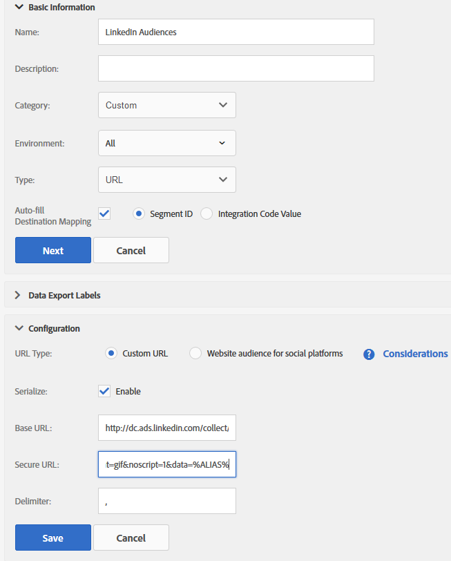
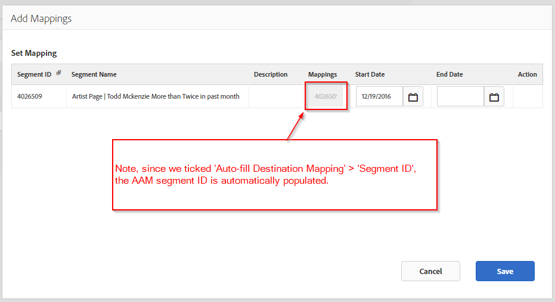

# 整合AAM (Adobe Audience Manager)與LinkedIn

瞭解如何在AAM (Adobe Audience Manager)中建立LinkedIn URL型目的地，用於推送AAM區段進行線上廣告目標定位。

## 說明 {#description}

### 環境

- Adobe Audience Manager (AAM)
- linkedIn

### 問題/症狀

在AAM UI中建立的AAM區段已準備好指派至LinkedIn目的地。 另請參閱 [建立區段](https://experienceleague.adobe.com/docs/audience-manager/user-guide/features/segments/segment-builder.html#create-segment)在Audience Manager使用手冊中。

本文會說明建立LinkedIn URL型目的地的程式，旨在將Adobe Audience Manager (AAM)區段推送至LinkedIn，以用於線上廣告目標定位。

<b>注意：</b> 此方法是提供的因應措施，可支援您在LinkedIn平台內運用AAM區段。 任何LinkedIn UI更新或問題都必須洽詢您個別的LinkedIn客戶代表。

## 解決方法 {#resolution}

1. 在AAM中建立新的URL目的地，名為 *linkedIn受眾* 設定（請參閱下方附加的熒幕擷圖）：
   <b>基本資訊 </b>

   - 環境：全部
   - 型別： URL
   - 勾選「自動填寫目的地對應」並選取「區段ID」

   <b>資料匯出標籤</b>
視需要選擇設定
   <b>設定</b>

   - URL型別：自訂URL
   - 勾選「序列化」
   - 基本URL：這是您輸入LinkedIn畫素的位置

   <b>範例</b>

   - *基本URL：<b></b>[http://dc.ads.linkedin.com/collect/?pid=XXXXX&amp;fmt=gif&amp;noscript=1&amp;data=%ALIAS%](http://dc.ads.linkedin.com/collect/?pid=XXXXX&amp;amp;fmt=gif&amp;amp;noscript=1&amp;amp;data=%25ALIAS%25)<b>*
   - *安全URL：</b><b>[https://dc.ads.linkedin.com/collect/?pid=XXXXX&amp;fmt=gif&amp;noscript=1&amp;data=%ALIAS%](https://dc.ads.linkedin.com/collect/?pid=XXXXX&amp;amp;fmt=gif&amp;amp;noscript=1&amp;amp;data=%25ALIAS%25)</b>*

   <b>位置</b>

   - <b>*pid</b>* ：是LinkedIn合作夥伴ID
   - <b>*%ALIAS%</b>*：是AAM巨集，將會以使用者符合資格的AAM區段ID動態取代，並以逗號「，」分隔

   <b>從頁面引發的畫素範例</b>
      <u><b><em><a href="https://dc.ads.linkedin.com/collect/?pid=51565&amp;fmt=gif&amp;noscript=1&amp;data=%25ALIAS%25" style="color:#0563c1; text-decoration:underline">https://dc.ads.linkedin.com/collect/?pid=51565&amp;fmt=gif&amp;noscript=1&amp;data=3401321,2993399,3263410</a></em></b></u>
      此範例顯示落入三個區段或ID的使用者：3401321、2993399和3263410。
      <b>範例URL目的地設定</b>
   
2. 將適用的區段指派給新建立的目的地。 對應值會自動填入AAM區段ID。
輸入結束日期（若適用），或保留空白以表示無結束日期。
   

現在AAM會選擇性地引發LinkedIn畫素，以動態方式填入區段ID，使個別使用者符合LinkedIn中的對象資格。
