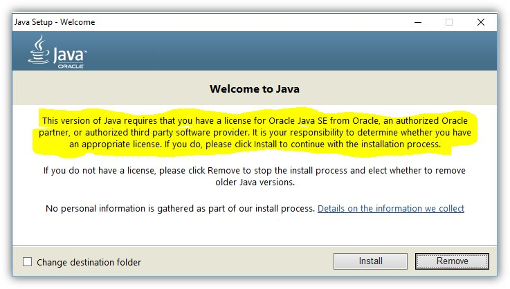

# Campaign Classic： Java授權

瞭解負責託管/混合/內部部署執行個體上Java授權的人員。

## 說明 {#description}

### 環境

Campaign Classic

### 問題/症狀

誰負責託管/混合/內部部署執行個體的Java授權？

## 解決方法 {#resolution}

Adobe檔案指出Java是先決條件，因此您應獲得Java授權。

OpenJDK也受到支援，因為 [相容性矩陣](https://experienceleague.adobe.com/docs/campaign-classic/using/release-notes/compatibility-matrix.html).
