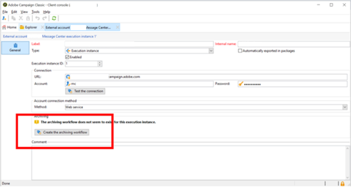

# Neolane會關閉訊息中心，如何重新建立MCSync工作流程

用於從同步資料的工作流程 *訊息中心執行例項* 至 *控制例項*&#x200B;已棄用舊版組建。 本文說明如何建立新的工作流程，以同步處理較新組建中的資料。

## 說明 {#description}

### <b>環境</b>

Adobe Campaign Classic

### <b>問題</b>

有些neolane流程已關閉，例如：

- 隔離匯入(`quarantineSynch`)
- 事件匯入(`eventSynch`)
- 成本計算(`budgetMgt`)

## 解決方法 {#resolution}

用於從同步資料的六個工作流程 *訊息中心執行例項* 至 *控制例項* 在較舊組建中，此版本已在較新的組建中停用。

這些工作流程包括：

1. 同步開始(`synchLaunch`)
2. 事件匯入(`eventSynch`)
3. 匯入傳遞訊息資格(`broadLogMsgSynch`)
4. 匯入事件傳遞記錄(`broadLogSynch`)
5. 匯入追蹤的URL (`trackingUrlSynch`)
6. 匯入事件追蹤記錄(`trackingLogSynch`)
7. 隔離匯入(`quarantineSynch`)

在較新的組建中，需要建立新的封存工作流程以同步資料。

請依照下列步驟操作：

1. 前往您的 *執行例項外部帳戶* 並按一下 <b>建立封存工作流程</b> 按鈕。

   

   它會建立表單&quot;`MCSync_<external account internal name>`「。
2. 停止舊的已棄用工作流程，並開始使用新的工作流程。
