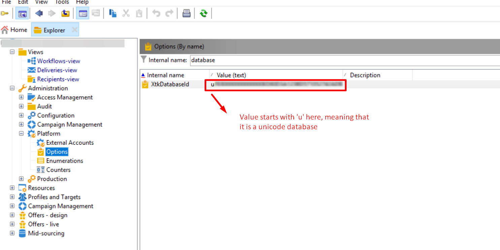

# Campaign SMTP字元編碼選項中的字元集不可見

## 說明 {#description}


<b>環境</b>
Adobe Campaign Classic Adobe Campaign

<b>問題</b>
傳送屬性中，Adobe Campaign SMTP字元編碼選項中的字元集不可見。

<b>原因</b>
原因是資料庫不是Unicode資料庫。


## 解決方法 {#resolution}


<b>解決方案</b>

1. 此 `XtkDatabaseId` 選項欄位中的值會定義資料庫的ID。 它以Unicode資料庫的「u」開頭。 請參閱 [Campaign Classic選項清單](https://experienceleague.adobe.com/docs/campaign-classic/using/installing-campaign-classic/appendices/configuring-campaign-options.html) 如需詳細資訊，請參閱Adobe Experience League的Campaign Classic檔案。


   
2. 這表示如果資料庫ID是Unicode，您可以檢視下列專案：

   
3. 當您變更 `XtkDatabaseId` 選項欄位中的值，則不會看到該零件 `IsUnicode()` 不符合程式碼的部分條件，如下所示：


```
container type="visibleGroup" visibleIf="EV(@messageType, 'mail') and IsUnicode()"
                     xpath="advancedParameters"
            container label="Character encoding" type="frame"
              input useDesc="true" xpath="@forceCodepage"/
              container type="visibleGroup" visibleIf="@forceCodepage"
                input xpath="@codepage"/
              /container
            /container
          /container
```


在此範例中，資料庫共同作業為「Latin1_General_CI_AS」。 因此， `XtkDatabaseId` 選項欄位中的值不是從u開始，因此零件不會顯示。

如需有關在資料庫中切換至Unicode的詳細資訊，請參閱 [切換至Unicode](https://experienceleague.adobe.com/docs/campaign-classic/using/monitoring-campaign-classic/updating-adobe-campaign/switching-to-unicode.html) (位於Adobe Experience League的Campaign Classic檔案中)。
