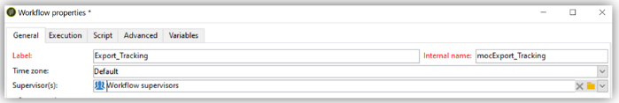
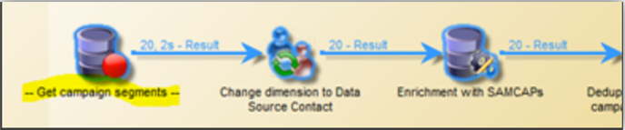
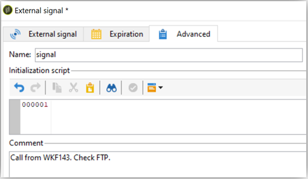

# 工作流程最佳實務 — 在Campaign Classic中進行設定和監控

本文說明在Adobe Campaign Classic中設定和監控工作流程的一些最佳實務。

## 說明 {#description}

### <b>環境</b>

- Adobe Campaign
- Adobe Campaign Classic

### <b>問題</b>

大部分時間，工作流程構成了平台核心功能（內建或自訂）的一部分。 因此，在設定時務必謹慎。

## 解決方法 {#resolution}

### 一般設定

#### 組織

在自訂資料夾中建立工作流程，例如在tableXXX中匯入。

只有當一般工作流程會影響整個平台（例如清除）時，您才可以考慮將其新增至內建中 <b>技術工作流程</b> 資料夾。

#### 工作流程名稱

如前所述，為工作流程指定適當的名稱和標籤非常重要。 由於運運算元並不一定都會參考檔案，請填入工作流程的 <b>說明</b> 欄位以彙總要執行的程式。

如果工作流程是涉及多個工作流程的流程的一部分，請在輸入標籤時儘量明確；使用數字是排序工作流程的絕佳方式（依標籤）。 例如：

- 001 — 匯入 — 匯入收件者
- 002 — 匯入 — 匯入銷售
- 003 — 匯入 — 匯入銷售明細
- 010 — 匯出 — 匯出傳送記錄檔
- 011 — 匯出 — 匯出追蹤記錄

#### 嚴重性

在工作流程屬性中設定工作流程的嚴重性，在 <b>執行</b> 標籤：

- 正常
- 生產
- 嚴重

在建立工作流程時提供此資訊，有助於瞭解所設定流程的嚴重性。

#### 記錄檔

JavaScript方法 `logInfo()` 是除錯工作流程的絕佳解決方案。 這個變數很有用，但必須謹慎使用，尤其是經常執行的活動：它會讓記錄超載，並顯著增加記錄表格的大小。

但您可能還需要 `logInfo()`. 有另外兩種解決方案可提供協助。

<b>保留兩次執行之間的中期母體結果</b>

可在工作流程屬性中使用的選項 <b>一般</b> 標籤，會很有用，但也很危險。 它可防止Adobe Campaign刪除在兩個執行之間建立的臨時表格。 雖然此變數可用於開發環境，但禁止在生產環境中使用，且應加以監控。 保留臨時表格可能會導致資料庫大小大幅增加，最終達到大小限制。 此外，這也會減慢備份速度。

<b>無工作流程</b> 應該隨時在生產環境中勾選此選項。

<b><u>在日誌中記錄SQL查詢</u>：</b>

可在 <b>執行</b> 索引標籤的工作流程屬性，這將會記錄工具從不同活動產生的所有SQL查詢。 這是檢視平台實際執行動作的絕佳方式。 不過，此選項僅應在開發期間暫時使用，而不應在生產環境中啟用。

#### 監控

應監視在生產環境中執行的所有排程工作流程，以便在發生錯誤時收到警報。

在工作流程屬性中，選取 <b>監督員群組</b>，即預設的「工作流程主管」或自訂群組。 請確定至少有一個運運算元屬於此群組，並設定了電子郵件。

<b><u>請勿讓工作流程暫停</u>：</b>

如果您建立暫時性工作流程，請確定其能夠正確完成且不會維持在「已暫停」狀態。 如果暫停，則表示您需要保留臨時表格，因此會增加資料庫的大小。

### 在工作流程中

#### 活動名稱

在開發工作流程時，所有活動都會有名稱，所有Adobe Campaign物件亦然。 雖然該名稱是由工具產生的，但我們建議您在設定時，以明確的名稱來重新命名它。 稍後執行此動作的風險在於，它可能會使用另一個先前活動的名稱中斷工作流程的活動。 因此，後續更新名稱會是一項困難的工作。

活動名稱可在以下連結中找到： <b>進階</b> 標籤。 不要把它們命名為query、query1、query11，而是要提供明確的名稱，例如 `querySubscribedRecipients`. 此名稱將會顯示在日誌中，如果適用，還會顯示在SQL記錄中，這有助於在設定工作流程時對其進行偵錯。

#### 活動中的JavaScript

初始化工作流程活動時，您可能想要新增JavaScript。 這可以在活動的中完成 <b>進階</b> 標籤。 若要更輕鬆找到工作流程，建議在活動標籤的開始和結束位置使用雙破折號，如下所示： *— 我的標籤 —*

#### 訊號

在大多數情況下，您不會知道從哪裡呼叫訊號。 為避免此問題，請使用 <b>註解</b> 欄位(在 <b>進階</b> 訊號活動的索引標籤，以記錄此活動的訊號預期來源。

#### 工作流程更新

不應直接更新生產工作流程。 除非流程包含使用範本工作流程建立行銷活動，否則應儘可能先在開發環境中測試流程。 只有在此驗證之後，才能在生產環境中部署及啟動工作流程。

封存的工作流程可保留在開發或測試平台上，位於 <b>已封存</b> 資料夾，但生產環境應儘可能保持乾淨。 若非作用中，應從生產環境中移除舊工作流程。
