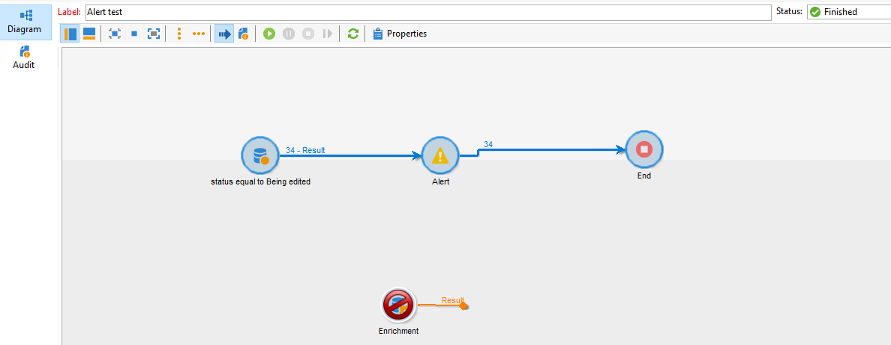

# 在傳遞表格上查詢後新增擴充活動時，警報活動失敗

## 說明 {#description}

<b>環境</b>
Campaign

## 解決方法 {#resolution}

為解決此問題，已針對研發建立NEO-25157，且此問題已在版本編號9330中修正。

<b>原因</b>

這是建置9032中的已知錯誤，當查詢時新增擴充活動<b> </b>會在傳遞狀態時於傳遞表格上執行。 無論擴充是否有任何作用，警示活動都會失敗

不擴充的成功：

因擴充而失敗：

稽核記錄： <b>*無法將傳遞ID \*\*\*\*\*載入快取：....</b>*

