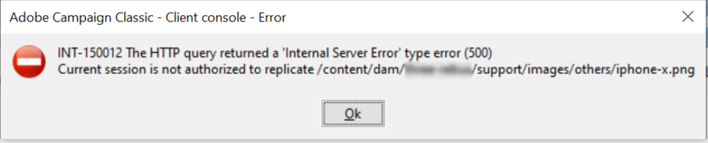

# AEM範本從Campaign Console擷取

## 說明

問題說明=將AEM範本同步至Campaign時，會出現下列錯誤：

INT-150012 HTTP查詢返回「內部伺服器錯誤」類型錯誤(500)當前會話未獲授權進行複製/content/dam/xxx/support/images/others/ophone-x.png

AEM 1和促銷活動層2分別產生下列錯誤：1 03.08.2020 11:21:12.517 \*WARN\* qtp1229648141-8634 com.adobe.ams.environment.indicator.wcm.impl.AemEnvironmentIndicatorFilter未接受uri /mnt/overlay/granite/ui/content/shell/header/actions/pulse.data.json 03.08.2020 11:21:14.038 \*WARN\* qtp1229648141-8819 com.adobe.ams.environment.indicator.wcm.impl.AemEnvironmentIndicatorFilter未接受uri /content/campaigns/xxx/mobile/xxx/samsung-note9.campaign.link.json 03.08.2020 11:21:14.046 \*ERROR\* 10.44.3.4 1596453674038POST/content/campaigns/xxx/mobile/xxx/samsung-note9.campaign.link.json HTTP/1.1 com.adobe.cq.mcm.campaign.servlets.LinkServlet服務連結/取消連結請求java.lang.NullPointerException時捕獲到異常：null位於com.adobe.cq.mcm.campaign.impl.NewsletterManagerImpl.link(NewsletterManagerImpl.java:113)com.day.cq.mcm.cq-mcm-campaign:1.3.14位於com.adobe.cq.mcm.campaign.servlets.LinkServlet.handlePost(LinkServlet.java:76)com.day.cq.mcm.cq-campaign:1.14位於com.adobe.cq.mcm.campaign.Link.doServlet(Post-java:cm.cm.q:mm.campaign:1.3.14 at org.apache.sling.api.servlets.SlingAllMethodsServlet.mayService(SlingAllMethodsServlet.java:146)org.apache.sling.api:2.20.0

2 2020-08-05 05:56:17同步過程中出錯2020-08-05 05:56:17 INT-150012 HTTP查詢返回「內部伺服器錯誤」類型錯誤(500)(iRc=-53)

## 解析度

問題說明=

復寫權限必須授予AEM伺服器中Campaign的AEM使用者。  我們在/content/campaign和/content/dam路徑下，為促銷活動的AEM使用者提供讀/寫/復寫權限，其中促銷活動資產存在。
