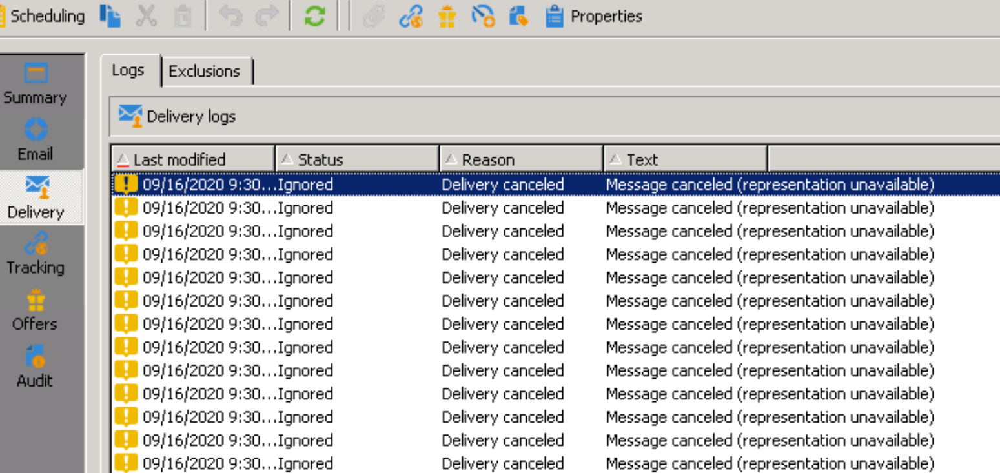
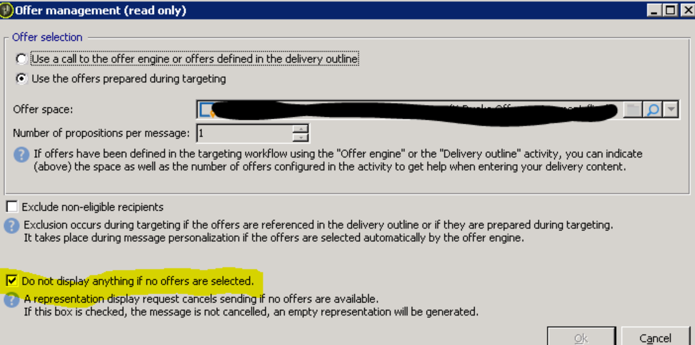

# Campaign ClassicV7 — 傳送中的訊息已取消（無法顯示）錯誤

## 說明

傳送電子郵件傳遞時出現以下錯誤訊息：

*[!UICONTROL 訊息已取消（無法顯示）]*

解析度熒幕擷圖如下： 

## 解決方法

方塊&quot;[!UICONTROL 如果未選取任何優惠，則不顯示任何內容。]&quot;應在傳送選件管理（傳送頂端列的一個小顯示圖示）中勾選以解決問題。
