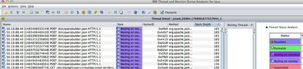
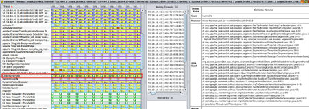

# AEM 對話串傾印分析

請依照本文詳述的步驟和最佳實務，使用成功分析AEM Java對話串傾印 [IBM對話串分析器](https://www.ibm.com/support/pages/ibm-thread-and-monitor-dump-analyzer-java-tmda) 工具。

## 說明 {#description}

<b>環境</b>

Adobe Experience Manager

<b>問題</b>

如何使用分析AEM Java對話串傾印 [IBM對話串分析器](https://www.ibm.com/support/pages/ibm-thread-and-monitor-dump-analyzer-java-tmda) 工具？

## 解決方法 {#resolution}

1. 下載並安裝 [IBM對話串分析器](https://www.ibm.com/support/pages/ibm-thread-and-monitor-dump-analyzer-java-tmda) (我們將其簡稱為IBM TDA)。
2. 從體驗效能問題的 AEM 執行個體擷取[對話串傾印](https://helpx.adobe.com/experience-manager/kb/thread-dumps-collection-analysis.html)。
3. 在 IBM TDA 中開啟對話串傾印。
4. 若要檢視對話串傾印的詳細資訊，請選取清單中的檔案，然後按一下 <b>執行緒詳細資訊</b> 按鈕。

   
5. 排序依據： <b>棧疊深度</b> 最長的棧疊在頂端。

   
6. 檢閱堆疊深度為 10 行或更長的對話串。 這些通常是人們最感興趣的對話串。

   記下感興趣的對話串。
7. 依執行緒排序 <b>狀態</b>.
8. 向下捲動至 <b>可執行</b> 執行緒。 可執行的對話串指在進行對話串傾印時積極使用 CPU 時間的對話串。

   *備註：檢閱下列專案時 <b>可執行</b> 執行緒，您可以忽略列於 <b>可忽略的Threads</b> 區段。*

9. 查詢屬於應用程式一部分的可執行的對話串，例如，背景作業對話串或請求對話串(請求對話串的名稱如下 —  *127.0.0.1 `[` 1347028187737`]`  GET/content/sites/global/en/sitemap.static-delivery.httpd.html HTTP/1.1*)。

   找到它們後，請逐一按一下。
10. 對於每個請求對話串，您可以檢視對話串名稱中的時間戳記，以瞭解使用者的瀏覽器何時向伺服器提出請求。

   例如，在以上對話串名稱中，時間戳記（以毫秒為單位的unix epoch格式）為 *1347028187737*.

   我們可以使用將該epoch數字轉換為日期/時間 [www.epochconverter.com](https://www.epochconverter.com/).

   每個對話串傾印都會顯示執行時的日期和時間。

   您可以透過請求時間和對話串傾印時間之間的時間差來檢視請求活動的時間。
11. 檢閱過請求對話串後，捲動瀏覽另一個 <b>可執行</b> 執行緒。

   找到感興趣的可執行緒後，請檢視中間面板 <b>等待執行緒</b>.

   那裡列出的Threads正在等待所選對話串釋出監視器。

   如果您沒有看到任何等待對話串，那麼您選取的對話串可能仍然是的所有者。 [鎖定](https://docs.oracle.com/javase/1.5.0/docs/api/java/util/concurrent/locks/Lock.html) (請參閱實作類別 [鎖定](https://docs.oracle.com/javase/1.5.0/docs/api/java/util/concurrent/locks/Lock.html) 以取得詳細資訊)。

   例如，使用 [ReentrantReadWriteLock](https://docs.oracle.com/javase/1.5.0/docs/api/java/util/concurrent/locks/ReentrantReadWriteLock.html) 您無法分辨哪個對話串是鎖定持有者，因為鎖定會在內部實作多個監視器。

   因此，您可能必須檢視原始程式碼以將其與可能是鎖定持有者的對話串進行比對。
12. 如果對話串有許多其他對話串正在等候的鎖定或監視器，則請檢查其餘的對話串傾印以檢視是否可以找到有相同問題的其他對話串。

   檢視其他傾印中是否仍然存在相同的對話串(在IBM TDA中，您可以選取多個對話串傾印並按一下 <b>比較Threads</b> 按鈕來檢視多個對話串傾印中的對話串狀態。

   
13. 請參閱 <b>收集器服務</b> 在下列熒幕擷圖中：

   
14. 在此檢視中，您可以檢視多個對話串傾印中的對話串，以瞭解它是否為長時間執行的對話串。

   基本上，如果執行緒位於 <b>可執行</b> 跨多個傾印的狀態，且棧疊長，這通常表示它是一個長時間執行的對話串。
15. 如果您沒有發現太多，請參閱 <b>可執行</b> 執行緒，然後返回執行緒清單，選取執行緒傾印，然後按一下 <b>監視器詳細資訊</b> 按鈕。

   IBM TDA將開啟視窗，顯示擁有對話串及其等待對話串的監視器樹檢視。

   *注意：它可能會顯示一些對話串池對話串，例如servlet引擎對話串池監視器，可以忽略閒置的對話串。*

   您通常可以分辨對話串是否為閒置的對話串池對話串，因為大多數時候它們只有10個或更少的棧疊行。

   

<u><b>執行緒層級CPU使用率（僅限Linux平台）</b></u><b>：</b>

1. 如果您已擷取 `top -H -b -n1 -p <javapid>` 除了對話串傾印之外的輸出，您就可以互動參照對話串層級CPU使用率。

   開啟頂端輸出並取得正在使用CPU的對話串的處理ID。

   將流程ID轉換為十六進位，然後在對應的對話串傾印檔案中搜尋該十六進位值。

   ID應符合 <b>nid</b> 其中一個執行緒。
2. 如果使用最多CPU的相符執行緒是 <b>VM執行緒</b> 或任何 <b>GC</b> 執行緒可能會發生記憶體問題。

   對更多對話串傾印和頂端輸出重複相同的練習，如果出現這些對話串佔用CPU時間的模式，則說明存在記憶體問題。
3. 如果您已確認記憶體問題，則在下次發生問題時擷取棧積傾印。

   檢視此 [分析記憶體問題文章](https://experienceleague.adobe.com/docs/experience-cloud-kcs/kbarticles/KA-17482.html?lang=en) 以取得有關擷取和分析棧積傾印的詳細資訊。

<b><u>可忽略的Threads</u>：</b>

- VM 對話串：這是一種 VM 系統對話串。
- 以 GC 任務對話串開始的對話串：這些是垃圾收集對話串。
- 名稱類似的Threads `- [ 1347028691218]  in code at java.net.PlainSocketImpl.socketAccept(Native Method)`：這些是來自servlet引擎的執行緒集區且等待新連線的執行緒。
