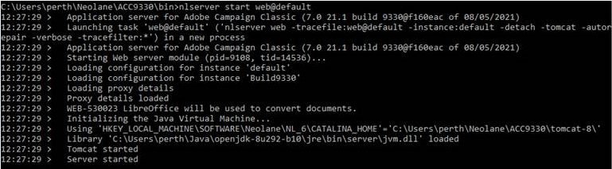

# ACC v7錯誤：「JVM-510037找不到Java動態程式庫」。


有2種解決方案：您可以手動將JavaSoft機碼新增至Windows登入中的 `Computer\HKEY_LOCAL_MACHINE\SOFTWARE`，或者，您可以使用兩個Windows環境變數來定義 `jvm.dll` 檔案可由Web模組找到。

## 說明 {#description}


### <b>環境</b>

Adobe Campaign Classic v7 (ACC v7)


### <b>問題/症狀</b>

<b>使用案例</b>  — 在Windows上執行的Campaign執行個體上，此問題發生於，將OracleJDK取代為Open JDK。

此範例已在所有Windows Campaign執行個體上安裝OracleJDK v1.8.0.191。 在其中一個Campaign執行個體中使用Open JDK取代OracleJDK後，WEB無法啟動並出現以下錯誤：

<b>`JVM-510037 Cannot find the Java dynamic library. Check that a JDK or a JRE is installed on the machine. (iRc=-53)`</b>

不過，Java已正確搭配正確的路徑和JAVA_HOME環境變數安裝。


## 解決方法 {#resolution}


為了執行Web模組，Campaign必須可看到JVM動態程式庫。 藉由移除OracleJDK，Windows登入中的JavaSoft機碼將會移除，而且會遺失對該JVM程式庫的任何參考。

有2種解決方案可解決此問題：

### <u>解決方案#1</u>

您可以手動將JavaSoft機碼新增至Windows登入中的 `Computer\HKEY_LOCAL_MACHINE\SOFTWARE`.


以下是範例(使用 `OpenJDK 1.8_292`)，您只需要新增以下專案：

`Windows Registry Editor Version 5.00`

`[ HKEY_LOCAL_MACHINE\SOFTWARE\JavaSoft]`


```
[ HKEY_LOCAL_MACHINE\SOFTWARE\JavaSoft\Java Runtime Environment] "CurrentVersion"="1.8""BrowserJavaVersion"="11.301.2"
```


```
[ HKEY_LOCAL_MACHINE\SOFTWARE\JavaSoft\Java Runtime Environment\1.8] "MicroVersion"="0""RuntimeLib"="C:\\Users\\perth\\Java\\openjdk-8u292-b10\\jre\\bin\\server\\jvm.dll""JavaHome"="C:\\Users\\perth\\Java\\openjdk-8u292-b10\\jre"
```


```
[ HKEY_LOCAL_MACHINE\SOFTWARE\JavaSoft\Java Runtime Environment\1.8.0_292] "MicroVersion"="0""RuntimeLib"="C:\\Users\\perth\\Java\\openjdk-8u292-b10\\jre\\bin\\server\\jvm.dll""JavaHome"="C:\\Users\\perth\\Java\\openjdk-8u292-b10\\jre"
```


 
而且下列路徑資料夾已新增至 <b>`Path` </b>環境變數。

`C:\Users\perth\Java\openjdk-8u292-b10\bin`

Web模組應該能夠如預期啟動：



### <u>解決方案#2</u>

可以定義兩個Windows環境變數的使用，以指示 `jvm.dll` 檔案可由Web模組找到。

變數包括：

- `USEENV=1`
- `JVMLIBDIR=<the path of the jvm.dll file>`


範例如下：


請注意， `JVMLIBDIR` 如果在Web模組上啟用詳細記錄功能，將會從記錄中顯示。
