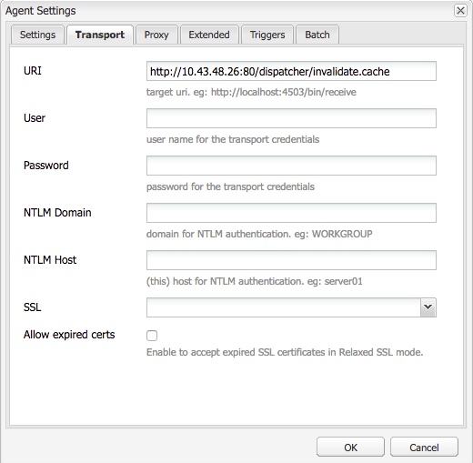

# AdobeManaged Services Dispatcher排清


探索快取排清機制和內容啟動工作流程的細微差別，這對於維護系統效率和資料完整性至關重要。

## 說明 {#description}


### <b>環境</b>

Adobe Experience Manager


### <b>問題/症狀</b>

本檔案說明排清的發生方式以及執行快取排清和失效的機制。

### 如何運作

#### 作業順序

對典型的工作流程的最佳詮釋是，當內容作者啟動頁面時，發佈者收到新內容時會觸發傳送器的排清請求，如下圖所示：


這個事件鏈結強調我們僅在專案是新的或變更時排清專案。  這可確保在清除快取之前，發佈者已收到內容，以避免在發佈者擷取變更之前可能發生排清的競爭條件。

#### 復寫代理

在作者上，有一個復寫代理程式設定為指向發行者，當有東西啟動時，它會觸發將檔案及其所有相依性傳送給發行者。

發佈者收到檔案時，會將復寫代理程式設定為指向在接收事件時觸發的傳送器。 然後它會序列化排清請求，並將其發佈到排程程式。

<b>作者復寫代理</b>

以下是已設定標準復寫代理程式的一些熒幕擷取畫面範例：


在作者上，通常為其復寫內容的每個發行者設定1或2個復寫代理。

- 第一個是將內容啟用推送到的標準復寫代理。
- 第二個是反向代理。  這是選擇性的，並設定為檢查每個發佈者的寄件匣，以檢視是否有新內容可拉入作者作為反向復寫活動


<b>發佈者復寫代理</b>

以下是設定的標準排清復寫代理程式的熒幕擷取畫面範例：


<b>Dispatcher Flush復寫接收虛擬主機</b>

Dispatcher模組會尋找特定標頭，以瞭解POST請求何時可以傳遞給AEM轉譯器，或者該請求是否已序列化為排清請求，且需要由Dispatcher處理常式本身處理。 以下是顯示這些值的設定頁面熒幕擷圖：


預設設定頁面會顯示 <b>序列化型別</b> 作為 *Dispatcher排清* 並設定錯誤等級：



在 <b>傳輸</b> 索引標籤中，您可以看到URI設定為指向將接收排清請求的Dispatcher的IP位址。 路徑 `/dispatcher/invalidate.cache` 模組無法判斷其是否為排清，您只能在存取記錄檔中看到明顯的端點，才能知道其為排清請求。 在 <b>延伸</b> 索引標籤中，我們將詳閱所有專案，確認這是傳送器模組的排清請求。


排清請求的HTTP方法只是具有某些特殊請求標題的GET請求：

- <b>CQ-Action</b>\
  這會根據請求使用AEM變數，其值通常為啟動或刪除
- <b>CQ-Handle</b>\
  這會根據請求使用AEM變數，其值通常是已清除專案的完整路徑，例如/content/dam/logo.jpg
- <b>CQ-Path</b>\
  這會根據請求使用AEM變數，其值通常是刷新專案的完整路徑，例如/content/dam
- <b>主機</b>\
  這是欺騙Host Header以鎖定特定目標的位置 `<` 虛擬主機`>`  在Dispatcher Apache網頁伺服器(/etc/httpd/conf.d/enabled_vhosts/aem_flush.vhost)上設定的限制。 這是一個硬式編碼值，符合aem_flush.vhost檔案的ServerName或ServerAlias中的專案


在 <b>觸發器</b> 索引標籤我們會記下我們使用的切換觸發器及其內容

- <b>忽略預設值</b>\
  啟用此功能，頁面啟用時就不會觸發復寫代理程式。 這是指當作者執行個體對頁面進行變更時會觸發排清的情況。 因為這是發行者，所以我們不想觸發該型別的事件。
- <b>接收時</b>\
  收到新檔案時，我們想要觸發排清。 因此，當作者傳送更新的檔案給我們時，我們將觸發並傳送排清請求給Dispatcher。
- <b>無版本設定</b>\
  核取此項以避免發行者因為收到新檔案而產生新版本。 我們將取代現有的檔案，並仰賴作者而非發佈者來追蹤版本。


現在，如果我們看看curl命令形式的典型排清請求是什麼樣子


```
$ curl \
-H "CQ-Action: Activate" \
-H "CQ-Handle: /content/dam/logo.jpg" \
-H "CQ-Path: /content/dam/" \
-H "Content-Length: 0" \ 
-H "Content-Type: application/octect-stream" \
-H "Host: flush" \
http://10.43.0.32:80/dispatcher/invalidate.cache
```


此排清範例會排清 `/content/dam` 路徑(透過更新 `.stat` 檔案時每小時精細度無法運作的問題。

#### .stat檔案

排清機制本質上很簡單，我們要說明 <b>.stat</b> 在檔案根目錄中產生的檔案，其中會建立快取檔案。

內部 `.vhost` 和 `_farm.any` 檔案時，我們會設定檔案根指令，以指定當一般使用者的請求傳入時，快取的位置以及儲存/服務檔案的位置。

如果您要在Dispatcher伺服器上執行下列命令，您會開始找到 `.stat` 檔案。

`$ find /mnt/var/www/html/ -type f -name ".stat"`

以下是您在快取中擁有專案，且排程程式模組傳送並處理的排清請求時，此檔案結構的外觀圖表：


<b>stat檔案層級</b>

請注意，每個目錄中都會有.stat檔案。 這是表示已發生排清的指標。  在上述範例中 <b>stat檔案層級</b> 設定已設為 <b>3</b> 在對應陣列設定檔案中。

stat檔案層級設定指出模組將周遊並更新.stat檔案的資料夾深度。 .stat檔案是空的，只不過是帶有日期戳記的檔案名稱，甚至可以手動建立，但可在Dispatcher伺服器的命令列上執行touch命令。

如果stat檔案層級設定得太高，則每個排清請求都會周遊接觸stat檔案的目錄樹狀結構。  這可能會嚴重影響大型快取樹狀結構的效能，並可能影響排程程式的整體效能。

將此檔案層級設定得太低，可能會導致排清請求清除的內容超出預期。 這進而會造成快取經常流失，而且從快取中提供的請求較少，進而導致效能問題。

<b>注意：</b> 將statfilelevel設定在合理的層級。  檢視您的資料夾結構，並確定其設定為允許簡潔的排清，而不需周遊太多目錄。 在系統效能測試期間進行測試並確定它符合您的需求。

支援語言的網站就是一個很好的範例。 典型的內容樹狀結構會包含下列目錄： `/content/brand1/en/us/`

在此範例中，使用stat檔案層級設定4。 這可確保您何時排清位於下的內容 <b>us</b> 不會造成語言資料夾被排清的資料夾。

<b>stat檔案時間戳記交握</b>

當對內容的請求進入相同的常式時，會發生下列情況：

1. 會比較.stat檔案的時間戳記與請求檔案的時間戳記
2. 如果.stat檔案比要求的檔案新，它將會刪除快取的內容並從AEM擷取新的內容，然後快取該內容。 然後提供內容
3. 如果.stat檔案的年代比要求的檔案還舊，它就會知道檔案是全新狀態並提供內容。


<b><u>快取交握：範例 `[` 1`]` </u></b>

在上述範例中，請求內容/content/index.html

index.html檔案的時間是2019-11-01 @ 6:21PM

最近的.stat檔案時間是2019-11-01 @ 12:22PM

瞭解我們上述所讀內容後，您可以發現index檔案比.stat檔案新，而且系統會從快取中提供該檔案給提出請求的一般使用者。

<b><u>快取交握：範例 `[` 2`]` </u></b>

在上述範例中，請求內容/content/dam/logo.jpg

logo.jpg檔案的時間是2019-10-31 @ 1:13PM

最近的.stat檔案時間是2019-11-01 @ 12:22PM

如本範例所示，該檔案比.stat檔案舊，將被移除並從AEM中拉取新的檔案，以便在提供給提出請求的一般使用者之前，在快取中取代該檔案。

### 伺服器陣列檔案設定

完整的設定選項集說明檔案已完整齊全：[設定AEM Dispatcher指南](https://experienceleague.adobe.com/en/docs/experience-manager-dispatcher/using/configuring/dispatcher-configuration#configuring-dispatcher_configuring-the-dispatcher-cache-cache)

我們將重點介紹一些與快取排清相關的設定。

#### 檔案根目錄

此設定專案位於伺服器陣列檔案的下列區段：


```
/myfarm {
    /cache {
        /docroot
```


您可以指定讓Dispatcher填入並管理的目錄做為快取目錄。

<b>注意： </b>此目錄應該與網頁伺服器設定要使用的網域之Apache檔案根目錄設定相符。

出於許多原因，在每個陣列中讓巢狀docroot資料夾位於Apache檔案根目錄的子資料夾所在的位置是糟糕的想法。

#### stat檔案層級

此設定專案位於伺服器陣列檔案的下列區段：


```
/myfarm {
    /cache {
        /statfileslevel
```


此設定會測量當排清請求傳入時需要產生多深的.stat檔案。

此 `/statfileslevel` 在下列數字處設定，檔案根目錄為 `/var/www/html/` 排清時會產生下列結果 `/content/dam/brand1/en/us/logo.jpg`

- 0 — 將建立下列stat檔案
   - /var/www/html/.stat
- 1 — 將建立下列stat檔案
   - /var/www/html/.stat
   - /var/www/html/content/.stat
- 2 — 將建立下列stat檔案
   - /var/www/html/.stat
   - /var/www/html/content/.stat
   - /var/www/html/content/dam/.stat
- 3 — 將建立下列stat檔案

   - /var/www/html/.stat
   - /var/www/html/content/.stat
   - /var/www/html/content/dam/.stat
   - /var/www/html/content/dam/brand1/.stat
- 4 — 將建立下列stat檔案

   - /var/www/html/.stat
   - /var/www/html/content/.stat
   - /var/www/html/content/dam/.stat
   - /var/www/html/content/dam/brand1/.stat
   - /var/www/html/content/dam/brand1/en/.stat
- 5 — 將建立下列stat檔案

   - /var/www/html/.stat
   - /var/www/html/content/.stat
   - /var/www/html/content/dam/.stat
   - /var/www/html/content/dam/brand1/.stat
   - /var/www/html/content/damn/brand1/en/.stat
   - /var/www/html/content/damn/brand1/en/us/.stat


<b>注意：</b>請記住，發生時間戳記交握時，會尋找最近的.stat檔案。

.stat檔案層級0且stat檔案僅限於 `/var/www/html/.stat` 表示存在於底下的內容 `/var/www/html/content/dam/brand1/en/us/` 會尋找最近的.stat檔案，並遍歷5個資料夾以尋找唯一存在於層級0的.stat檔案，並比較其日期。 這表示在如此高的層級排清實際上會使所有快取的專案失效。

#### 允許失效

此設定專案位於伺服器陣列檔案的下列區段：


```
/myfarm {
    /cache {
        /allowedClients {
```


在此設定內部，放置了允許傳送排清請求的IP位址清單。 如果排清請求進入Dispatcher，則必須來自受信任的IP。 如果您設定錯誤或從不受信任的IP位址傳送排清請求，會在記錄檔中看到下列錯誤：


```
[ Mon Nov 11 22:43:05 2019]  [ W]  [ pid 0000 (tid 139859875000000)]  Flushing rejected from 00.00.0.00
```


#### 無效規則

此設定專案位於伺服器陣列檔案的下列區段：


```
/myfarm {
    /cache {
        /invalidate {
```


這些規則通常會指出哪些檔案可透過排清請求失效。

為了避免重要檔案因頁面啟用而失效，您可以設定規則，指定哪些檔案可以失效以及哪些檔案必須手動失效。 以下是僅允許html檔案失效的設定範例：


```
/invalidate {
   /0000 { /glob "*" /type "deny" }
   /0001 { /glob "*.html" /type "allow" }
}
```


## 解決方法 {#resolution}


### 測試/疑難排解

當您啟動頁面並獲得成功啟動頁面的綠燈時，您應該希望您啟動的內容也會從快取中清除。

您重新整理頁面，看到舊內容，就會看到綠燈。

讓我們依照幾個手動步驟進行排清程式，深入瞭解可能出現的問題。  從發佈者Shell使用curl執行以下排清請求：


```
$ curl -H "CQ-Action: Activate" \
-H "CQ-Handle: /content/<PATH TO ITEM TO FLUSH>" \
-H "CQ-Path: /content/<PATH TO ITEM TO FLUSH>" \
-H "Content-Length: 0" -H "Content-Type: application/octet-stream" \
-H "Host: flush" \
http://<DISPATCHER IP ADDRESS>/dispatcher/invalidate.cache
```


測試排清請求範例：


```
$ curl -H "CQ-Action: Activate" \
-H "CQ-Handle: /content/customer/en-us" \
-H "CQ-Path: /content/customer/en-us" \
-H "Content-Length: 0" -H "Content-Type: application/octet-stream" \
-H "Host: flush" \
http://169.254.196.222/dispatcher/invalidate.cache
```


向排程程式發出請求命令後，您將想要在日誌中檢視中已完成的操作以及對.stat檔案執行的操作。 追蹤記錄檔，您應該會看到下列專案，以確認排清請求已送達Dispatcher模組


```
[ Wed Nov 13 16:54:12 2019]  [ I]  [ pid 19173:tid 140542721578752]  Activation detected: action=Activate [ /content/dam/logo.jpg] 
[ Wed Nov 13 16:54:12 2019]  [ I]  [ pid 19173:tid 140542721578752]  Touched /mnt/var/www/html/.stat
[ Wed Nov 13 16:54:12 2019]  [ I]  [ pid 19173:tid 140542721578752]  Touched /mnt/var/www/html/content/.stat
[ Wed Nov 13 16:54:12 2019]  [ I]  [ pid 19173:tid 140542721578752]  Touched /mnt/var/www/html/content/dam/.stat
[ Wed Nov 13 16:54:12 2019]  [ I]  [ pid 19173:tid 140542721578752]  "GET /dispatcher/invalidate.cache" 200 purge [ publishfarm/-]  0ms
```


現在我們看到模組擷取並確認排清請求，我們需要看看它對.stat檔案有何影響。 執行以下命令，並在您發出另一個排清時監視時間戳記更新：


```
$ watch -n 3 "find /mnt/var/www/html/ -type f -name ".stat" | xargs ls -la $1"
```


從命令輸出中可以看到目前.stat檔案的時間戳記


```
-rw-r--r--. 1 apache apache 0 Nov 13 16:54 /mnt/var/www/html/content/dam/.stat
-rw-r--r--. 1 apache apache 0 Nov 13 16:54 /mnt/var/www/html/content/.stat
-rw-r--r--. 1 apache apache 0 Nov 13 16:54 /mnt/var/www/html/.stat
```


現在，如果我們再次執行排清，您將看到時間戳記更新


```
-rw-r--r--. 1 apache apache 0 Nov 13 17:17 /mnt/var/www/html/content/dam/.stat
-rw-r--r--. 1 apache apache 0 Nov 13 17:17 /mnt/var/www/html/content/.stat
-rw-r--r--. 1 apache apache 0 Nov 13 17:17 /mnt/var/www/html/.stat
```


讓我們比較內容的時間戳記和.stat檔案的時間戳記


```
$ stat /mnt/var/www/html/content/customer/en-us/.stat
  File: `.stat'
  Size: 0           Blocks: 0          IO Block: 4096   regular empty file
Device: ca90h/51856d    Inode: 17154125    Links: 1
Access: (0644/-rw-r--r--)  Uid: (   48/  apache)   Gid: (   48/  apache)
Access: 2019-11-13 16:22:31.000000000 -0400
Modify: 2019-11-13 16:22:31.000000000 -0400
Change: 2019-11-13 16:22:31.000000000 -0400
 
$ stat /mnt/var/www/html/content/customer/en-us/logo.jpg
File: `logo.jpg'
  Size: 15856           Blocks: 32          IO Block: 4096   regular file
Device: ca90h/51856d    Inode: 9175290    Links: 1
Access: (0644/-rw-r--r--)  Uid: (   48/  apache)   Gid: (   48/  apache)
Access: 2019-11-11 22:41:59.642450601 +0000
Modify: 2019-11-11 22:41:59.642450601 +0000
Change: 2019-11-11 22:41:59.642450601 +0000
```


如果您檢視任何時間戳記，您會注意到內容的時間戳記比.stat檔案新，這告知模組從快取中提供檔案，因為它比.stat檔案新。

簡而言之，更新此檔案的時間戳記並不符合「清除」或取代的資格。
