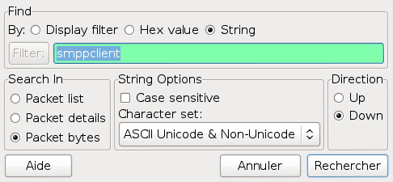
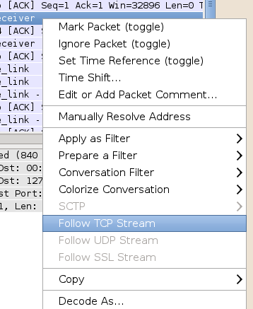
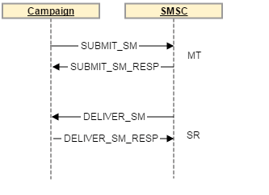
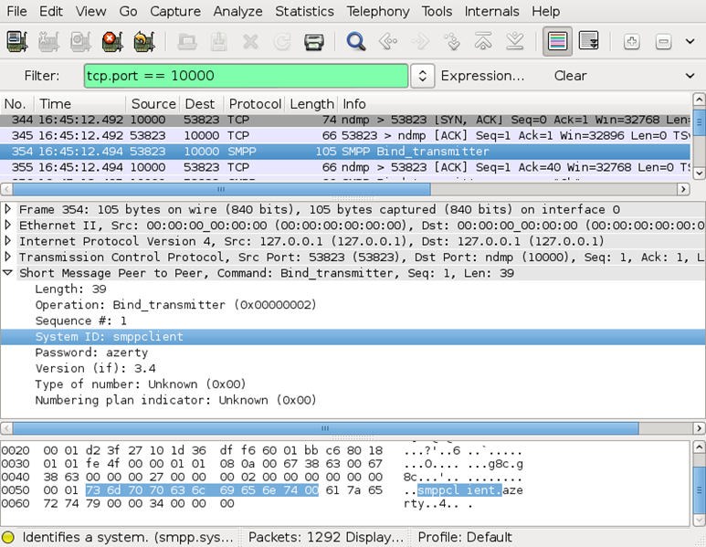
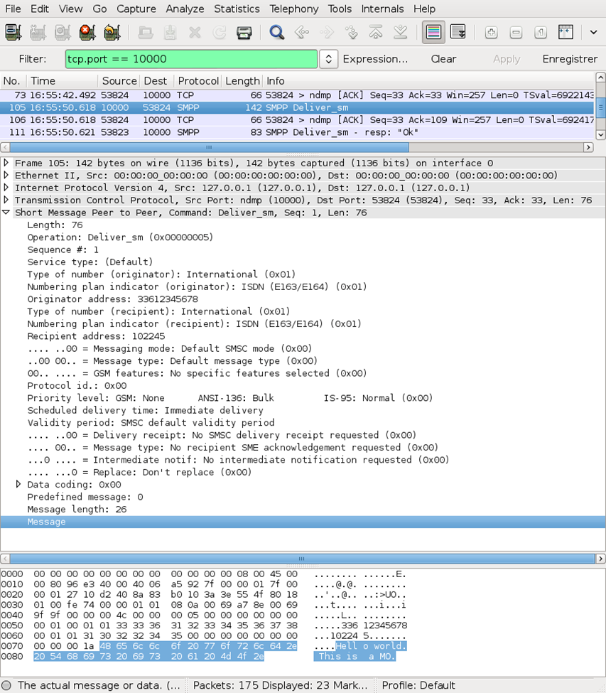
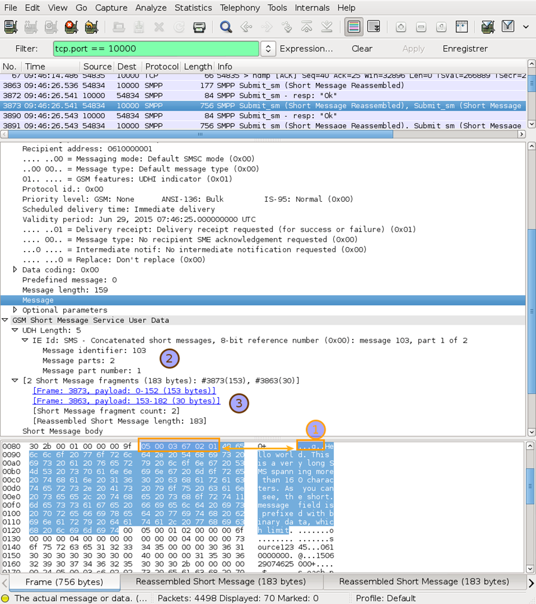
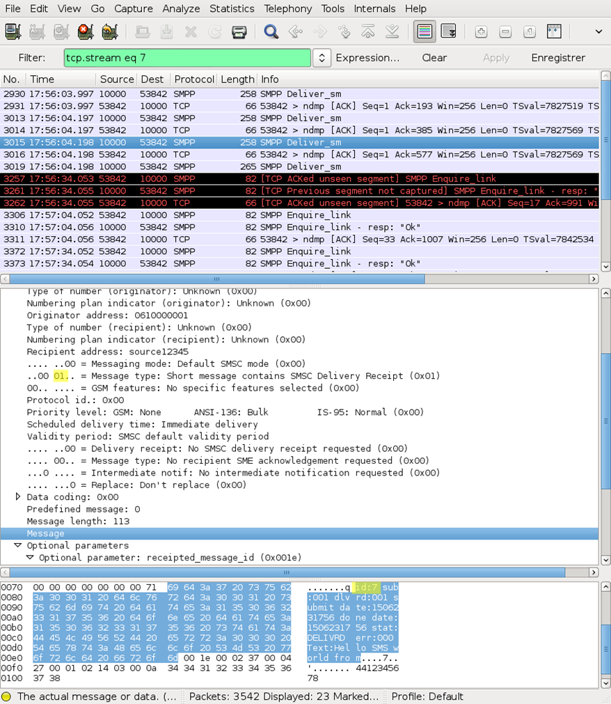
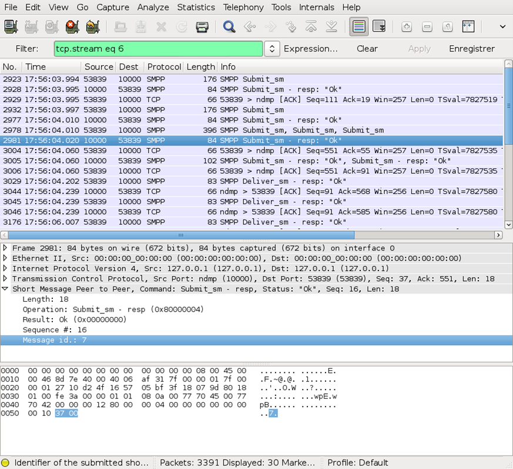
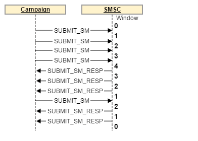

# 使用Wireshark進行SMPP通訊協定分析


本文會說明如何使用Adobe Campaign Classic的Wireshark執行SMPP通訊協定分析。

## 說明 {#description}


<b>環境</b>

Adobe Campaign Classic (ACC)

<b>問題/症狀</b>

瞭解如何使用Wireshark分析SMPP流量。

大多數高輸送量短訊息服務中心(SMS-C)都與SMPP通訊協定版本3.4相容。此通訊協定允許傳送SMS並接收有關這些SMS傳遞內容的資訊。 SMPP 通訊協定會以 PDF 文件形式記錄在網際網路上的 SMPP 通訊協定規格 v3.4 中。

本文不能替代該規格：它會提供有關如何詮釋通訊協定規格並將其與Wireshark顯示器對應的實用技巧，以協助對Adobe Campaign和SMS-C合作夥伴之間的問題進行疑難排解。

由於SMPP通訊協定包含許多部分，留待實作團隊來詮釋，因此不同的SMS-C之間存在差異。

對問題進行疑難排解時，請和 SMS-C 合作夥伴保持聯絡，以獲取資訊或協助您再次檢查所獲得的資訊。如果 SMS-C 回覆錯誤，您的 SMS-C 合作夥伴將是告訴您為什麼回覆錯誤的最佳人選。如果您使用的是 SMPP 模擬器而不是連線到真正的 SMS-C，您應該使用原始程式碼 (或偵錯工具) 來了解正在發生的情況。


## 解析度 {#resolution}


<b>不使用Wireshark擷取網路流量</b>

如果您無法直接存取電腦，則可能需要使用類似tcpdump的命令列工具來進行擷取。 如果您已經知道連線的 TCP 連接埠，請放置正確的篩選器以避免擷取所有流量。這是一個tcpdump命令列範例，可擷取連線埠12345至 <b>outfile.pcap</b>：


```
tcpdump -i any -w outfile.pcap tcp port 12345
```


檔案 <b>outfile.pcap</b> 然後可以在Wireshark中開啟以進行進一步分析。

本主題假設您熟悉Wireshark的基本知識：擷取封包、定義簡單篩選器、讀取封包詳細資訊。 簡要介紹可在以下網址取得： [howtogeek — 如何使用Wireshark來擷取、篩選和Inspect封包](https://www.howtogeek.com/104278/how-to-use-wireshark-to-capture-filter-and-inspect-packets/).

若要在Wireshark中篩選掉SMPP流量，有三個重要的功能：

- 在SMS-C的連線埠上使用顯示篩選器。例如，如果SMS-C使用連線埠10000，請使用以下篩選器：
  `tcp.port == 10000`


- 若要依電話號碼或文字內容隔離資料封包，請使用包含以下設定的搜尋功能：    


- 使用 <b>追隨TCP資料流</b> 工具以隔離您正在處理的資料流。
關閉彈出的紅色/藍色文字視窗，因為它只對和 SMPP 無關的文字通訊協定有用。


- 


### <b>SMPPP通訊協定</b>

通訊協定會在TCP上執行並且是完全二進位，這表示需要特殊工具，例如Wireshark （或十六進位編輯器），才能解密資料流的內容。

串流由獨立的 PDU 組成：每個 PDU 都是一則訊息，包含命令、狀態、序列編號和基於命令的其他資訊。

由於 TCP 作為串流通訊協定的性質，一個 TCP 資料封包可能包含多個 PDU，而 PDU 可能跨越 2 個或更多 TCP 資料封包。Wireshark將正確地重新組裝PDU，因此對於Wireshark使用者來說大部分都是透明的。

以下是傳送MT時透過網路然後接收SR的PDU範例：



注意：可在SMPP規格（SMPP命令集）的第5.1.2.1節中找到標準命令清單。

### <b>SMPP回應</b>

SMPP通訊協定要求所有命令都由回應PDU確認：

BIND_TRANSMITTER由確認 *BIND_TRANSMITTER_RESP*， *SUBMIT_SM* 確認者 *SUBMIT_SM_RESP*&#x200B;等

會設定回應逾時，通常為10、30或60秒。 回應可能包含正面確認（命令_status = 0）或錯誤（請參閱5.1.3） *命令狀態*， *表5-2* 在SMPP規格中取得標準錯誤清單)。 大多數時候，這些回應是立即的，並且不會達到回應逾時。

請確保區別 SMPP 回應錯誤和 SR 錯誤程式碼：相同的錯誤程式碼在回應錯誤或 SR 錯誤欄位中可能表示不同的內容。回報錯誤碼時，您必須非常小心找到它的位置，因為該值的含義取決於其上下文。

### <b>SMPP連線初始化</b>

SMPP連線從使用TCP連線開始。 然後行銷活動傳送BIND作業，由BIND RESP確認。 SMPP規格的第4.1節中說明了這些作業（BIND作業）。
<br><br>


繫結作業會執行登入/密碼檢查並交換有關平台名稱、版本和規格中說明的其他欄位的資訊。


注意：可以在system_id欄位中找到登入。


在Campaign中，您應該會看到 *BIND_TRANSMITTER* 啟動MT傳輸時封包，以及 *BIND_RECEIVER* 封包 *nlsm s* 觸發MO/SR連線。

<b>傳送器、接收器和收發器：</b> Campaign Classic 的 SMPP 連接器會在單獨的傳送器/接收器模式下運作：有兩種 TCP 連線，一個用於傳輸 MT，另一個用於接收 MO 和 SR。請注意，TCP連線一律由Campaign起始，即使對於接收器模式亦然。

SMPP 還提供收發器模式，但此模式未在 Campaign Classic 的 SMPP 連接器中實作。

SMPP 連接器使用多個並行連線來傳輸 MT。由於聯結器的設計方式，這是無法控制的。
<b>接收MO</b>
當繫結接收方後，SMS-C可以隨時傳送MO。 傳送MO時會使用 *DELIVER_SM* PDU含位元2-5 / *esm_clas s* 清除(通常 *esm_class* 將只是0)。


<br><br>
此 *DELIVER_SM* PDU必須由 *DELIVER_SM_RESP* 具有相同的PDU *sequence_number*.
<b>傳送MT</b>
若要傳送MT，必須將傳送器成功繫結。 首先，檢查繫結流程是否已成功執行。

MT會以 *SUBMIT_SM* PDU。 SMS-C應該會快速回覆 *SUBMIT_SM_RESP* PDU：此回應封包比較特殊，因為其中包含了SMS-C的資料庫中訊息的ID （在和SMS-C合作夥伴通話時一定要包含此ID，以協助他更快地找到訊息）。 此 ID 將出現在 SR 中，並且是將 MT 與其對應的 SR 比對的唯一方法。

欄位 *registered_delivery* （在規格的第5.2.17節中說明）向SMS-C指示是否為這個特定的MT請求SR。 如果您沒有收到特定訊息的SR，請檢查欄位是否在 *SUBMIT_SM* PDU。


<b>MT的編碼</b>
注意：SMS編碼是一個複雜的主題，包含許多陷阱和各種實施。


正確做法是在出現編碼問題時務必和SMS-C合作夥伴聯絡。 您的SMS合作夥伴對受支援的編碼和由於其技術平台的限制可能適用的特殊規則有準確的瞭解。 讓他們檢查您傳送給他們的內容以及他們傳回給您的內容。 這是成功且穩定互相連線的唯一途徑。

簡訊訊息會使用特殊的 7 位元編碼，通常稱為 GSM7 編碼。請參考Wikipedia GSM 03.38 （英文版）。

在SMPP通訊協定中，會將GSM7文字展開為每個字元8位元，以較容易進行疑難排解。 SMS-C 在傳送到手機之前會將其封裝成每個字元 7 位元。這表示 SMS 的 short_message 欄位在 SMPP 框架中可能長達 160 位元，而在行動網路上傳送時上限卻是 140 字元 (簡單地捨棄了最重要的位元)。

如果出現編碼問題，請檢查以下重要事項：

- 首先，確保您知道哪些字元屬於哪種編碼。GSM7 由於其變音符號 (重音符號) 的部分支援而聲名狼藉。尤其是在法文中，é 和 è 是 GSM7 的一部分，但 ê、â 或 ï 卻不是。用在西班牙文時，情況也好不到哪裡去。
- 包含 cedilla (ç) 的 C 在 GSM7 字母表中僅以大寫形式出現，但有些手機以小寫或「智慧」型大小寫呈現：一般推薦是完全避免並移除 cedilla (仍然可以法文讀取) 或切換到 UCS-2。
- 請勿在簡訊中使用 ASCII，除非 SMS-C 合作夥伴明確要求：這種編碼會浪費空間，因為它有 8 位元的字元並且覆蓋範圍比 GSM7 小。
- Latin-1 並非總是受到支援：在嘗試使用 Latin-1 之前，請檢查和您的 SMS-C 合作夥伴的相容性。
- Adobe Campaign Classic 連接器不支援國家語言轉換表。您必須改用 UCS-2。
- UCS-2 和 UTF-16 經常被手機混合使用。對於傳送表情符號和其他 UCS-2 中不存在且很少使用的字元的人來說，這是一個問題。
- Wireshark不支援GSM7編碼：特殊字元的顯示將不正確。 如果您需要檢查 GSM7 字串是否正確編碼，您必須將十六進位程式碼和 GSM7 表進行比較。


此 *data_coding* 欄位會說明使用哪種編碼。 唯一的問題是值 0 表示規格中的預設 SMS-C 編碼，但一般來說卻表示 GSM7。使用SMS-C檢查 *合作夥伴什麼編碼與data_coding = 0相關聯(Adobe Campaign僅支援GSM7進行data_coding* = 0)。

訊息的大小上限取決於它的編碼。下表總結了所有相關資訊：


| 編碼 | data_coding | 訊息大小 (字元) | 多部分簡訊的部分大小 | 可用字元 |
| --- | --- | --- | --- | --- |
| GSM7 | 0 | 160 | 152 | [GSM7 基本字元集 + 擴充功能](https://zh.wikipedia.org/wiki/GSM_03.38) (擴充字元佔 2 個字元) |
| Latin-1  | 3 | 140 | 134 | ISO-8859-1 |
| UCS-2 UTF-16 | 8 | 70 | 67 | Unicode (因手機而異) |

<b>使用者資料標題(UDH)</b>
UDH （使用者資料標頭）是新增到SMS文字中的小型二進位標頭。 它們可以觸發特殊功能，例如簡訊連線、國家語言轉換表、標誌/影像 (很少使用) 或 WAP 推送。

由於 UDH 是文字欄位 (short_message SMPP 欄位) 的一部分，因此它縮短了 SMS 的有效大小。例如，連接的簡訊UDH 每個簡訊部分將消耗 6 個位元組 (即 6 個真正的 8 位元位元組，而不是 7 位元字元)，為每則訊息部分僅留下 152 個 7 位元字元的空間。

Wikipedia有關於使用者資料標題和連線的SMS的值得一讀的文章（英文版）。

若要知道 short_message 是否包含 UDH，請檢查 esm_class 的第 6 位元和第 7 位元 (參閱規格的第 5.2.12 節)。Wireshark會剖析介面中的UDH並提供精確資訊。
<br><br>
在上面的熒幕擷圖中，您可以看到訊息欄位中的使用者資料標題(1)、UDH中包含的資訊(2)以及一些不屬於封包但由Wireshark計算的其他資訊(3)：短訊息正文欄位尤其有趣，因為它包含由Wireshark重新組裝的完整訊息。
<b>接收SR</b>
當繫結接收方後，SMS-C可以隨時傳送SR。 SR會使用DELIVER_SM PDU傳送，包含位元2-5個 *esm_class*&#x200B;設定。




此 *DELIVER_SM* PDU必須由 *DELIVER_SM_RESP* 具有相同的PDU *sequence_number*. 若要查詢與此SR相符的MT，請搜尋 *SUBMIT_SM_RESP* 具有相同ID。 例如，這是與SR相符的MT：




SR僅會在以下情況下傳送： *registered_delivery* 欄位設定於MT中。

注意： Adobe Campaign Classic SMPP聯結器不處理在 *SUBMIT_SM_RESP* 封包。 該規格沒有明確禁止這種行為，但它被認為是不良行為 (這表示訊息在傳送之前已經被接收)。如果您經常遇到這種情況，請要求您的SMS-C合作夥伴修復其平台。
<b>破譯SR的short_message欄位</b>
SR PDU的文字欄位有SMPP通訊協定規格附錄B中說明的特殊編碼。 不幸的是，這種格式只是一種推薦，而不是通訊協定的一部分，儘管大多數 SMS-C 或多或少都尊重這種格式。

您應該直接向SMS-C合作夥伴索取其實作的檔案，並仔細檢查它是否和您在Wireshark中看到的相符。 很多時候，SMS-C 的實作者甚至不了解他們的實作，這會導致問題和誤解。如果對此欄位有任何疑問 (尤其是錯誤程式碼)，請隨時向 SMS-C 合作夥伴尋求協助。

基本格式如下：


```
id:IIIIIIIIII sub:SSS dlvrd:DDD submit date:YYMMDDhhmm done date:YYMMDDhhmm stat:DDDDDDD err:EEE

Text:........
```


這些是讀取上述行的一般準則：

- 此ID與中已傳送的相同。 *SUBMIT_SM_RESP*&#x200B;於相符的MT。
- 您可以忽略文字欄位中的問題：此欄位被Campaign忽略，因為如果使用另一種編碼而不是純英數字元ASCII傳送SMS，該欄位即無用、不可靠，甚至可能完全無法讀取。 這是正常行為。
- 欄位名稱不區分大小寫（例如，id： sub： Text：也可以寫成ID： SUB： text：）。
- 此 *dlvrd*&#x200B;欄位通常不可靠，除非SMS-C合作夥伴會紀錄下來。
- 日期可能有任何時區，這使得它們實際上毫無用處，或者它們完全是錯誤的，因為遠端伺服器的時鐘已關閉。
- 此 *stat*&#x200B;欄位可能有除附錄B中定義的值之外的其他值。使用常識和SMSC合作夥伴的檔案來理解其含義。
- 此 *錯誤*&#x200B;欄位完全取決於SMS-C，並且大部分時間由SMS-C合作夥伴記錄。 通常，程式碼 000 表示成功，而任何其他程式碼都表示錯誤。該欄位通常是數字，但也可能是十六進位。

<b>同一個MT的多個SR</b>
有些SMS-C會為同一個MT傳送多個SR以追蹤MT在網路中的進展。 這幾乎毫無用處，因為大多數時候用戶端只想知道何時收到訊息 (這通常是最後一個 SR)。

如有疑問，請僅處理從SMS-C收到的最新SR以查詢訊息的狀態。
<b>smpp視窗</b>
由於操作和回應不同步，您可以透過在等待回應之前傳送多個操作PDU來最佳化轉移速率。 沒有回覆的訊息數稱為視窗。

最大視窗為4的傳輸範例：



目前實作無法控制視窗，並期望遠端SMS-C足夠快以處理MT。
