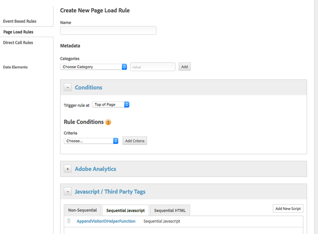
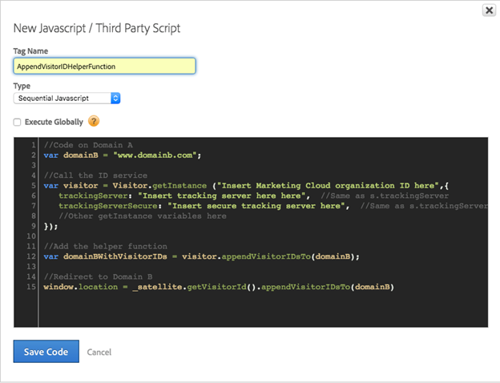

# 如何在Marketing Cloud動態標籤管理員中設定AdobeID服務協助程式函式


本文提供在Adobe動態標籤管理員中設定Marketing CloudID服務協助程式功能的詳細指南。

## 說明 {#description}


### <b>環境</b>

Adobe Experience Cloud

### <b>問題/症狀</b>

本文將逐步說明如何實作Adobe Marketing Cloud ID服務 [附加訪客ID函式](https://experienceleague.adobe.com/docs/id-service/using/id-service-api/methods/appendvisitorid.html?lang=zh-Hant) 位於AdobeDynamic Tag Management (DTM)中。

<b>注意：</b> 在中載入Marketing CloudID服務VisitorAPI.js 1.8.0或更新版本 [DTMMarketing CloudID服務](https://experienceleague.adobe.com/docs/id-service/using/id-service-api/methods/getmcvid.html) 在原始網域和目標網域上。 測試應在封鎖Cookie以驗證功能的瀏覽器情況下完成。


## 解決方法 {#resolution}


### <b>設定 — 網域A</b>

在網域A上使用自訂協力廠商Javascript在頁面載入規則的連續頂端設定目標網域（網域B）。

如需範例，請參閱下列熒幕擷取畫面：







```clike
//Code on Domain A
var domainB = "www.domainb.com";
 
//Call the ID service
var visitor = Visitor.getInstance ("Insert Marketing Cloud organization ID here",{
trackingServer:"Insert tracking server here here", //Same as s.trackingServer
trackingServerSecure: "Insert secure tracking server here", //Same as s.trackingServerSecure
...
//Other getInstance variables here
...
});
 
//Add the helper function
var domainBWithVisitorIDs = visitor.appendVisitorIDsTo(domainB);
 
//Redirect to Domain B
window.location = _satellite.getVisitorId().appendVisitorIDsTo(domainB)
```


<b>注意：</b> 若要重新導向至更明確的路徑，則網域設定必須反映該意圖。 如果重新導向需要更動態的建構，則可將自訂程式碼新增至資料元素或直接呼叫規則。 例如︰`var domainB = "http://www.domainb.com/products/"`

### <b>驗證 — 網域B</b>

從網域A導覽至網域B。透過在開發人員主控台中呼叫下列專案，驗證網域B上的MID符合網域A上的MID：  `_satellite.getVisitorId().getMarketingCloudVisitorID()().appendVisitorIDsTo(domainB)`
