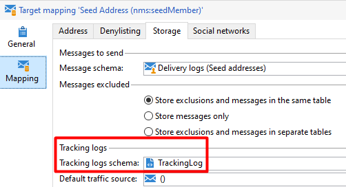

# 跟蹤工作流顯示&quot;PGS-220000 [!DNL PostgreSQL] 錯誤：錯誤：關係&quot;t1&quot;不存在錯誤

## 說明


在最近的版本編號升級9343或更新版本後，您可能會遇到追蹤工作流程產生的下列錯誤：


```
nlmodule    PGS-220000 PostgreSQL error: ERROR:  relation "t1" does not exist LINE 1: ...t, T3.iArticle, T2.iType FROM NmsTrackingUrl T2,  T1 LEFT OU... 
nlmodule    WDB-200001 SQL statement 'SELECT T1.tsLog, T1.iDeliveryId, T1.iUrlId, T1.sSourceType, T3.dAmount, T3.iArticle, T2.iType FROM NmsTrackingUrl T2,  T1 LEFT OUTER JOIN NmsWebTrackingLog T3 ON iTrackingLogId = iWebTrackingLogId WHERE T1.tsLog  :#(1)# AND T1.tsLog = :#(2)#  AND T1.iUrlId=T2.iTrackingUrlId ORDER BY T1.tsLog' could not be executed.   Param(0)=09/17/2020 8:55:00 PM   Param(1)=09/16/2020 8:55:00 PM
nlmodule    Attribute 'broadLog-id' unknown (see definition of schema 'Tracking logs (nms:trackingLog)').
```


## 解析度


從詳細追蹤記錄中，我們發現追蹤工作流程在合併資料時失敗：


```
00000000 00000000 1 info log Consolidating tracking logs for the period 09/16/2020 3:55:00 PM, 09/17/2020 3:55:00 PM...
00000000 00000000 1 info wdbc Select: 00000000  SELECT T1.tsLog, T1.iDeliveryId, T1.iUrlId, T1.sSourceType, T3.dAmount, T3.iArticle, T2.iType FROM NmsTrackingUrl T2, T1 LEFT OUTER JOIN NmsWebTrackingLog T3 ON iTrackingLogId = iWebTrackingLogId WHERE T1.tsLog  :#(1)# AND T1.tsLog = :#(2)# AND T1.iUrlId=T2.iTrackingUrlId ORDER BY T1.tsLog
00000000 00000000 2 info wdbc Param(0)=09/17/2020 8:55:00 PM
00000000 00000000 2 info wdbc Param(1)=09/16/2020 8:55:00 PM
00000000 00000000 1 error log PGS-220000 PostgreSQL error: ERROR: relation "t1" does not exist\nLINE 1: ...t, T3.iArticle, T2.iType FROM NmsTrackingUrl T2, T1 LEFT OU...\n \n. (iRc=-2006)
00000000 00000000 1 error log WDB-200001 SQL statement 'SELECT T1.tsLog, T1.iDeliveryId, T1.iUrlId, T1.sSourceType, T3.dAmount, T3.iArticle, T2.iType FROM NmsTrackingUrl T2, T1 LEFT OUTER JOIN NmsWebTrackingLog T3 ON iTrackingLogId = iWebTrackingLogId WHERE T1.tsLog  :#(1)# AND T1.tsLog = :#(2)# AND T1.iUrlId=T2.iTrackingUrlId ORDER BY T1.tsLog' could not be executed.\n Param(0)=09/17/2020 8:55:00 PM\n Param(1)=09/16/2020 8:55:00 PM (iRc=-2006)
```


每次追蹤工作流程啟動時，都會根據設定提取所有目標對應並更新資料。

在此情況下，一個目標對應會造成問題。 請參閱下列內容：



基本上，<b> NMS:追蹤記錄</b> 架構不應用於監視日誌，因為該架構與資料庫(SQL)表無關。

總之，此問題與升級無關，更與目標對應設定錯誤有關。
