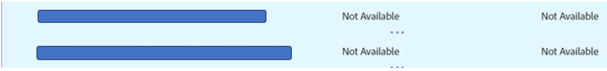

# Audience Manager — 在AAM UI中，當無法儲存或收到錯誤時進行模型疑難排解

## 說明

<b>問題詳細資訊： </b>

<b>問題1:</b> 即使尚未達到模型限制，您仍無法在AAM客戶UI中儲存模型。 另外，在保存模型時，不會收到任何錯誤。 按一下「儲存」按鈕時，不會發生任何情況。

<b>問題2: </b>您無法在AAM客戶UI中停用或刪除模型。 停用或刪除時，畫面會顯示「存取此特徵已撤銷」錯誤，請參閱下方的螢幕擷圖。

## 解析度

<b>答案1:</b> 檢查模型中區段所使用的所有特徵。 您可能會發現某個特徵摘自Audience Marketplace，但模型訂閱並未針對您在模型中使用的特徵啟用。 在這種情況下，您將無法保存模型。 若要儲存模型，請移除所有這些特徵，或啟用這些特徵的模型訂閱。 請注意，如果要啟用模型訂閱，則可能需要為此支付額外費用。

<b>答案2: </b>克服此問題的可能方法之一：

檢查模型中您要停用或刪除的區段所使用的所有特徵。 螢幕擷圖下方勾選「 」畫面下可能會顯示無法使用的特徵：

移除所有無法使用的特徵，然後嘗試停用或刪除模型。 現在，您可能可以成功停用或刪除模型。

*注：在UI中收到錯誤訊息時，您可能想要啟用開發人員工具，當您使用 [!DNL Chrome] 然後選擇「網路」頁簽，然後重試並複製上述操作。 開發人員工具可能會提供更多詳細資訊，包括導致您無法完成動作的相依性，這可協助您了解UI錯誤背後的原因。*
