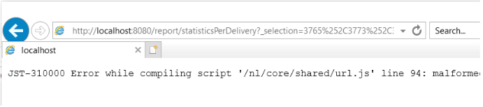
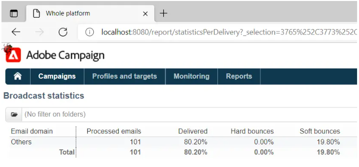

# 由於IE限制，傳遞報告無法彙總ACC中的統計資料


瞭解如何解決(IE) Internet Explorer中URL長度為2048個字元的Campaign Classic問題。 從Adobe Campaign Classic (ACC)複製URL至報表，以解決此問題。

## 說明 {#description}


### 環境

Adobe Campaign Classic

### 問題/症狀

此問題與Internet Explorer中的URL長度上限（2048個字元）有關： [詳細資料](https://support.microsoft.com/en-us/topic/maximum-url-length-is-2-083-characters-in-internet-explorer-174e7c8a-6666-f4e0-6fd6-908b53c12246).

頁面的HTML來源會在ACC使用者主控台中顯示報表。

內的URL `href` 屬性 `<` a`>`  標籤沒有問題，也不會被截斷。 不過，如果URL是在IE中複製並貼上，則會將連結截斷為2048個字元，您將無法開啟該連結：



在使用者主控台中的報表上按一下滑鼠右鍵，然後選取「 」，也會發生同樣的情況 *在新視窗中開啟*. 這會自動開啟IE，但位址列將是空的。 如果選取的傳送較少，且步驟重複，IE將會以正確的URL開啟。

目前，業界正在努力以Edge取代IE。 Edge是以Chromium為基礎，沒有這些URL限制。 這已經透過將長URL複製/貼入Edge得到了確認，這不會截斷URL並在沒有任何問題的情況下開啟報表：




## 解決方法 {#resolution}


從IE到Edge的轉換完成後，此問題應自動解決。 在此之前，可部署下列因應措施：

- 以滑鼠右鍵按一下報告，然後選取「 」，從ACC使用者端主控台將報告的URL複製到報告中 *複製捷徑*. 這應該會將整個URL複製到剪貼簿。
- URL需要稍微修改才能在其他瀏覽器中開啟。 複製的URL將遵循此模式：


  ```
  javascript:switchToReportView(%22statisticsPerDelivery%22,%20%22/report/statisticsPerDelivery?_selection=3765%252C37...
  ```


- URL中開頭如下的部分 `/report/` 需要複製並附加至執行個體的位址。 在此案例中，地址為 *localhost*：


  ```
  http://localhost:8080/report/statisticsPerDelivery?_selection=3765%252C3773%252C3781%252C3789%252C3793%252C3769%...
  ```


- 將產生的URL複製到另一個瀏覽器（Edge、Firefox或Chrome應該都能正常運作）。

