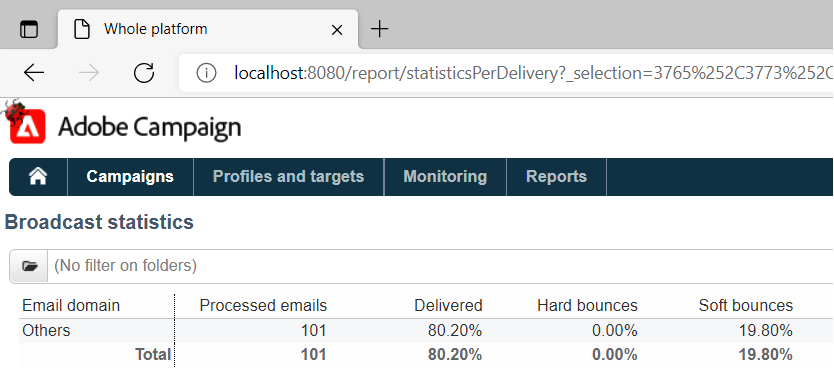

# 由於IE限制，傳遞報告無法彙總ACC中的統計資料

## 說明 {#description}

<b>環境</b><br>Campaign Classic<br>

<b>問題/症狀</b>
此問題與Internet Explorer中的URL長度上限（2048個字元）有關： [詳細資料](https://support.microsoft.com/en-us/topic/maximum-url-length-is-2-083-characters-in-internet-explorer-174e7c8a-6666-f4e0-6fd6-908b53c12246).

頁面的HTML來源會在ACC使用者端中顯示報告。

a標籤的href屬性內的URL是好的，即不會截斷。 不過，如果URL是在IE中複製並貼上，則會截斷連結至2048個字元，且無法開啟：


在ACC使用者端內以滑鼠右鍵按一下報告，然後選取 *「在新視窗中開啟。」* 這會自動開啟IE，但位址列將是空的。 如果選取的傳送較少，且步驟重複，IE將會以正確的URL開啟。

目前，業界正在努力以Edge取代IE。 Edge是以Chromium為基礎，沒有這些URL限制。 這已經透過將長URL複製/貼入Edge得到了確認，這不會截斷URL並在沒有任何問題的情況下開啟報表：




## 解決方法 {#resolution}


從IE到Edge的轉換完成後，此問題應自動解決。 在此之前，可部署下列因應措施：

- 在報表上按一下滑鼠右鍵並選取「 」，從ACC使用者端複製報表的URL *複製捷徑*. 這應該會將整個URL複製到剪貼簿。
- URL需要稍微修改才能在其他瀏覽器中開啟。 從使用者端複製的URL將遵循此模式：


```
javascript:switchToReportView(%22statisticsPerDelivery%22,%20%22/report/statisticsPerDelivery?_selection=3765%252C37...
```


- URL中開頭如下的部分 `/report/` 需要複製並附加至執行個體的位址。 例如（在此例中，位址是localhost）：


```
http://localhost:8080/report/statisticsPerDelivery?_selection=3765%252C3773%252C3781%252C3789%252C3793%252C3769%...
```


- 將產生的URL複製到另一個瀏覽器 — Edge、Firefox或Chrome應該都能正常運作。
