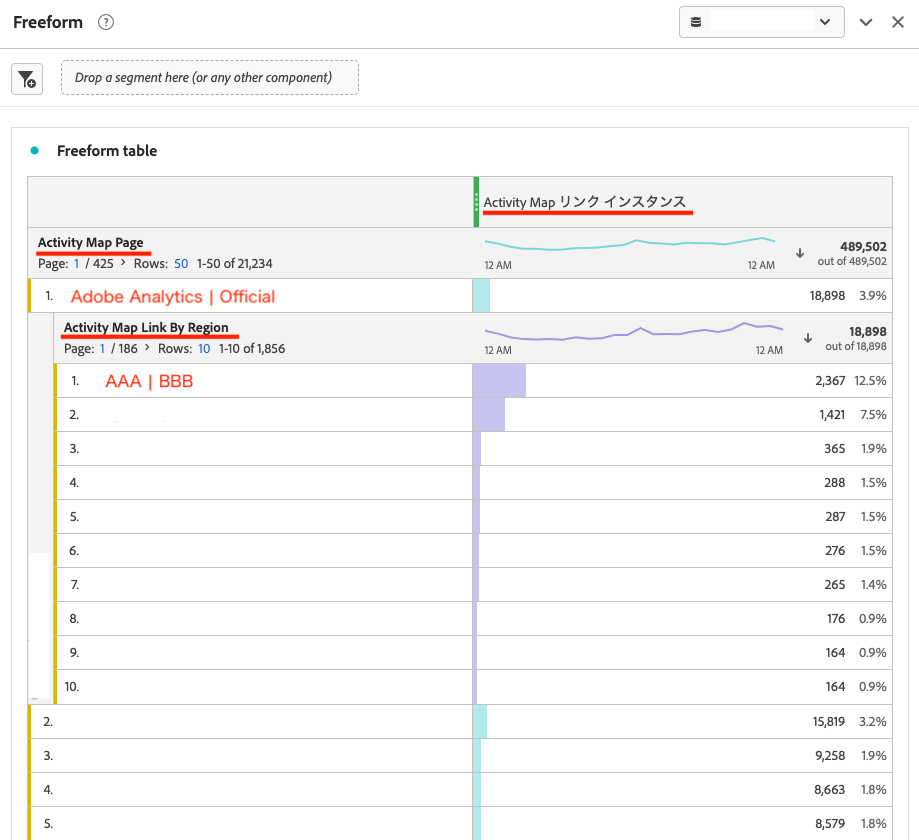

# 如何在Adobe Analytics工作區的「自由格式表格」上重現Activity Map的「連結報告」

## 說明 {#description}

<b>環境</b>
- Customer Journey Analytics
- Analytics

   <b>問題/症狀</b> 如何在Adobe Analytics工作區的「自由表格」上重新產生連結報表？ 哪種量度和Dimension可用來產生此專案？ 

## 解決方法 {#resolution}

以下是範例的範例。

1. 在Adobe Analytics中開啟新專案 *工作區* 並放置 *自由表格* 從左側邊欄進入面板。
2. 接下來，比對 *日期範圍* 在面板中新增至您在Activity Map中報告的時段。
3. 對於 *Dimension*，使用 *Activity Map頁面* 和 *Activity Map連結與地區*. 放下 *Activity Map頁面* 在自由格式表格上，然後放置 *Activity Map連結與地區* ，請在您要報告的頁面上。 顯示的專案將是 *連結識別碼* 和 *地區* 顯示在Activity Map中的專案 *連結報告*. (範例： `Link ID=AAA` | `Region=BBB`)
4. 使用 *Activity Map例項* 的 *量度*. 插入此 *Activity Map例項* 置入頂端的「量度」拖放區域中。
5. 現在，您可以在中重現相同的值， *自由表格* 如同在 *連結報告*.

·Analytics中的Activity Map報表 — AnalyticsActivity Map維度
[https://experienceleague.adobe.com/docs/analytics/analyze/activity-map/activitymap-reporting-analytics.html](https://experienceleague.adobe.com/docs/analytics/analyze/activity-map/activitymap-reporting-analytics.html)

<b>注意</b>：比較Activity Map的 *連結報告* 使用 *自由表格*，您可能會找到 *連結識別碼*&#x200B;於 *自由表格* 未顯示在 *連結報告*. 這是因為Activity Map的 *連結報告* 和 *自由表格*&#x200B;則不同。 在 *連結報告*，則系統只會報告啟動Activity Map及載入頁面時存在的連結元素。 另一方面，在 *自由表格*，即使連結目前不存在於Activity Map頁面上，過去點按過並在target中測量過的所有連結都會納入報告中。 在此情況下，您需要使用 *區段* 或 *篩選* 函式以移除清單上不必要的專案 *自由表格*.
