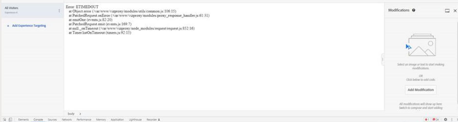

# Target VEC偵錯/疑難排解

## 說明

無法在Adobe Target VEC中載入頁面URL。

以下是一些錯誤範例：

- 
- 
- 

## 解決方法

1. 請嘗試清除Cookie和快取，或以無痕模式開啟您的網站。  

1. 請嘗試使用替代瀏覽器，例如 —  [!DNL Mozilla Firefox]， [!DNL Microsoft Edge]

1. 在這種情況下，請安裝VEC Helper瀏覽器擴充功能

   1. 從安裝擴充功能 [https://chrome.google.com/webstore/detail/adobe-target-vec-helper/ggjpideecfnbipkacplkhhaflkdjagak](https://chrome.google.com/webstore/detail/adobe-target-vec-helper/ggjpideecfnbipkacplkhhaflkdjagak)

   1. 若要使用擴充功能，請按一下中的VEC Helper瀏覽器擴充功能圖示， [!DNL Chrome] VEC中的瀏覽器工具列。 

   1. 啟用&quot;**插入target資料庫**&quot;和&quot;cookie&quot;將「開啟」。

      

   1. 快顯視窗會要求您允許擴充功能將Target程式庫新增至頁面，以啟用編寫功能（您需要允許此功能）。

   1. 允許來自網站設定的不安全內容([https://experienceleague.adobe.com/docs/target/using/experiences/vec/troubleshoot-composer/mixed-content.html?lang=en](https://experienceleague.adobe.com/docs/target/using/experiences/vec/troubleshoot-composer/mixed-content.html?lang=en))

      - 按一下掛鎖（警告）圖示，然後按一下網站設定。

      - 捲動到不安全內容，然後使用下拉式清單將「封鎖（預設）」變更為「允許」。

      - 重新載入VEC頁面。

   1. 透過下列步驟，將EEC （增強體驗撰寫器）設定為停用

      - 前往 [!DNL Target] - [!UICONTROL 管理] - VEC — 關閉EEC

        

   注意：如果問題仍然存在，請開啟瀏覽器開發人員主控台，並在那裡尋找錯誤訊息。

1. 如果網站包含多重層級iframe，則不支援目標。  

**如何在VEC中存取登入後頁面**

1. 在VEC中載入頁面，然後按一下「瀏覽器標籤」，輸入您的認證，然後移至您想要的頁面。  
1. 按一下 [!UICONTROL 撰寫] 標籤並在VEC內進行修改。 

或

1. 在新標籤中開啟網站，然後輸入您的登入認證。
1. 在中開啟VEC [!DNL Target] 並在登入後直接載入頁面。 
1. 現在，頁面將在VEC中載入以進行修改。
