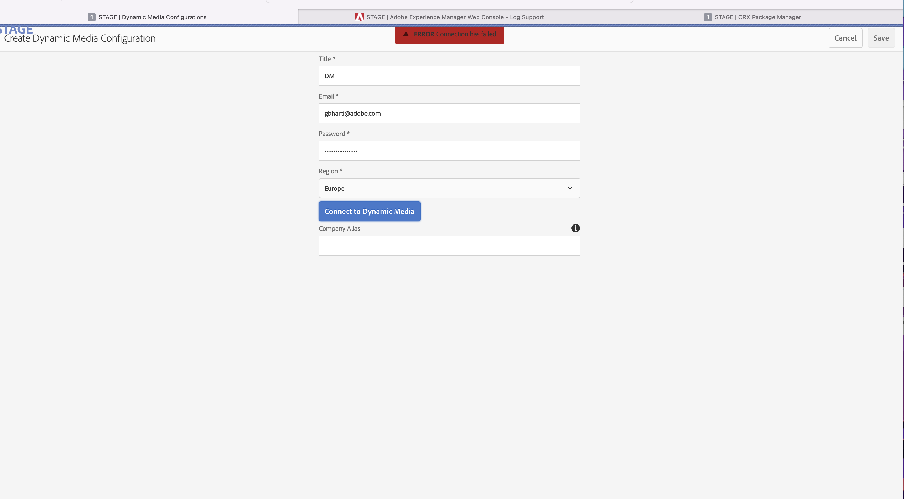

# 升級至Service Pack 11後無法在AEM中建立Dynamic Media設定。


探索AEM問題Service Pack 11更新後的疑難排解，包括連線失敗、NullPointerExceptions和JAXB-API挑戰。

## 說明 {#description}


<b>環境</b>

- Adobe Dynamic Media Classic

- Adobe體驗管理

<b>問題/症狀</b>

將AEM更新至Service Pack 11後，管理員無法在全域資料夾中建立動態媒體設定。

錯誤：連線已失敗顯示在UI上。

此問題僅發生在將Service Pack升級至11之後。

<b>熒幕擷圖：</b>



<b>記錄檔中的錯誤：</b>


```
ERROR: The following errors can be seen in the error logs:

ERROR [ 88.198.190.189 [ 1649063458948]  POST /libs/settings/dam/scene7/endpoints/europe/jcr:content.companies.json HTTP/1.1]  org.apache.sling.engine.impl.SlingRequestProcessorImpl service: Uncaught Throwable

java.lang.NullPointerException: null

In the console, this error is printed:

POST http://18.193.241.174:4502/libs/settings/dam/scene7/endpoints/europe/jcr:content.companies.json 500 (Server Error)


These additional errors can also be seen in the error logs:

ERROR Apache Sling Repository Startup Thread #1 com.day.cq.dam.scene7.impl.utils.RequestUtils Unable to create jaxbinstance :

javax.xml.bind.JAXBException: Implementation of JAXB-API has not been found on module path or classpath.

ERROR [ 88.198.190.189 [ 1649328294390]  POST /libs/settings/dam/scene7/endpoints/europe/jcr:content.companies.json HTTP/1.1]  com.day.cq.dam.scene7.impl.utils.Request

Utils Unable to create jaxbinstance :

java.lang.NullPointerException: null

ERROR [ sling-oak-observation-1]  com.day.cq.dam.scene7.impl.utils.RequestUtils Unable to create jaxbinstance :

java.lang.NullPointerException: null
```


<b>重現問題的步驟：</b>
<br>`[` 1`]` ：導覽至工具 — `>`  Cloud Service。
<br>`[` 2`]` ：按一下「Dynamic Media設定」 。
<br>`[` 3`]` ：嘗試連線至Dynamic Media。  
<br> <br>


## 解決方法 {#resolution}


我們需要從系統/主控台移除下列組合（如果存在）

1. jaxb註解v2.9.8
2. jaxb api v2.3.1


移除上述套件組合後，AEM應該只剩下這些套件組合 — 

1. jaxb執行階段v2.3.2.2
2. jaxb-api-2.3 v2.3.0.3


依照上述步驟，重新啟動安裝程式，您應該就能建立Dynamic Media設定。
