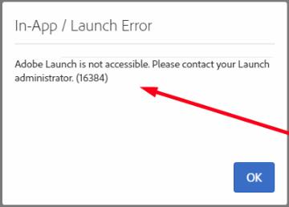

# ACS中的Launch同步無法運作

如果Adobe Campaign Standard中的Launch同步功能無法運作，請先登出再重新登入。

## 說明 {#description}

### <b>環境</b>

Adobe Campaign Standard

### <b>問題/症狀</b>

您可能會在啟動期間遇到下列錯誤：
   

## 解決方法 {#resolution}

此問題可透過登出並再次登入來解決。

<b>原因</b>

Launch預期某些引數可能因瀏覽器特定問題而偶爾不存在。
