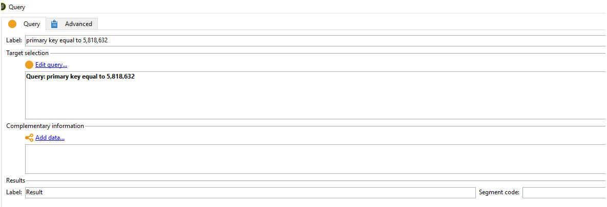

# 無法刪除WebApp — 錯誤：重複鍵值違反唯一約束&quot;xtkdictionarystring_name&quot;

## 說明

有時您可能無法刪除WebApp，並可能遇到以下錯誤PGS-220000 PostgreSQL錯誤：錯誤：重複鍵值違反唯一約束「xtkdictionarystring_name」。

詳細資訊：機碼(iobjectid、ssourceid、slocale)=(0, del_5818632_closedFormLog, en)已存在。

## 解析度

如果您在ACC中刪除不再需要的Web應用程式時遇到此錯誤，解決方法是透過工作流程刪除webApp（如下所示）

- 建立新工作流程並將查詢和更新活動拖放至畫布上。

- 查詢Webapp的主鍵，並在更新資料活動中將操作類型更新為刪除。 請注意，刪除應用後，除非完成資料庫還原，否則將無法檢索它。

