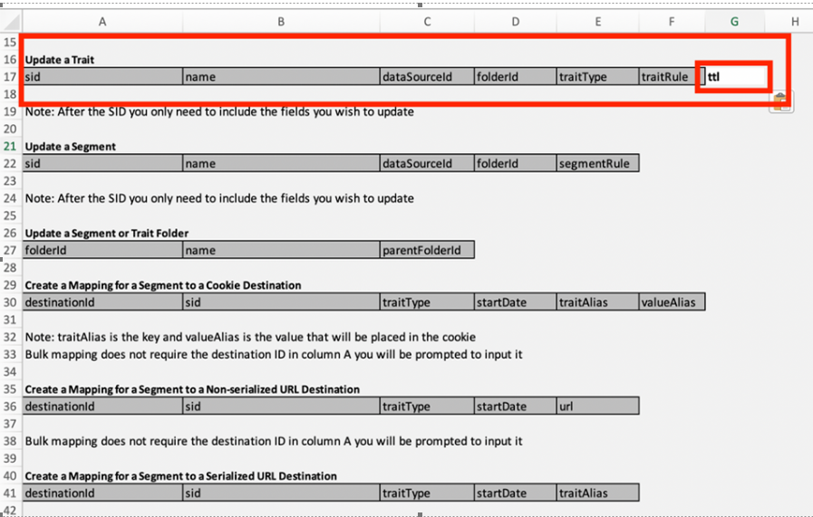

# 如何使用BAAAM工具大量變更特徵的到期日/TTL

瞭解如何使用批次Audience Association Manager工具大量變更特徵的存留時間。

## 說明 {#description}

如何使用BAAM工具（批次對象關聯管理員工具）大量變更特徵的存留時間。

## 解決方法 {#resolution}

參考 [Audience Manager的大量管理工具](https://experienceleague.adobe.com/en/docs/audience-manager/user-guide/reference/bulk-management-tools/bulk-management-intro) 以取得有關BAAAM工具的詳細資訊。

調整標題以新增TTL欄位並變更您的偏好設定 — 請參閱下面的熒幕擷圖

- 需要適當的存取權才能編輯特徵。
- 請確定您傳遞了正確的SID、特徵型別等值集。 如有疑問，請利用BAAAM工具（批次對象關聯管理員工具）中的「請求特徵」選項來提取現有詳細資料，並用於您的請求。

