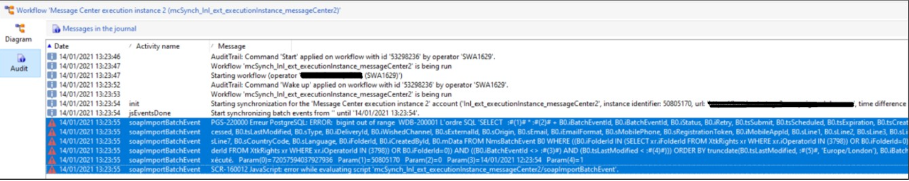

# Campaign Classic:PGS-220000 PostgreSQL:錯誤：bigint超出範圍

## 說明 {#description}

<b>環境</b>
Adobe Campaign Classic v7

<b>問題</b>
從Message Center運行存檔工作流(mcSynch)時出現以下錯誤：

## 解決方法 {#resolution}

<b>解決方案</b>
問題在於用來識別RT執行例項的執行例項ID。

如上所示，使用的值為 *5080.5170萬*.

封存工作流程會使用執行例項ID，如下所示：

vars.CELL_OFFSET + &quot;\*&quot; + vars.cellId + &quot; + @id&quot;

執行

- CELL_OFFSET是「連接資訊」活動建立的常數(72057594037927936)。

- cellId是執行實例ID。

上面的這兩個數字相乘。 結束結果數大於Postgres bigint類型的最大值([PostgreSQL數值類型](https://www.postgresql.org/docs/10/datatype-numeric.html))。

這兩個值會新增至查詢，如下所示：

選擇   <b>:#(1)# \* :#(2)# + B0.iBatchEventId</b>, B0.iBatchEventId, B0.iStatus, B0.iRetry, B0.tsSubmit, B0.tsScheduled, B0.tsExpiration, B0.tsCreated, B0.tsProcessing, B0.tsProcessed, B0.tsLastModified, B0.sType, B0.iDeliveryId, B0.iShed, B0,S0.s IdOrigin, B0.sEmail, B0.iEmailFormat, B0.sMobilePhone, B0.sRegistrationToken, B0.iMobileAppId, B0.sLine1, B0.sLine2, B0.sLine3, B0.sLine4, B0.sLine5, B0.sLine6, B0.sLine0, B0.s0sLanguage, B0.iFolderId, B0.iCreatedById, B0.mData FROM NmsBatchEvent B0，其中(B0.iFolderId IN(SELECT xr.iFolderId FROM XtkRights WHERE.iOperatorId IN(3798))或B0.iFolder(I0)(B)和(I0)FOLDERId IN(從XtkRights xr WHERE xr.iOperatorId IN(3798))或B0.iFolderId=0))和((B0.iBatchEventId:#(3)#)和(B0.tsLastModified :#(4)#))ORDER(B0.Modified,B0))#, &#39;Europe/London&#39;), B0.iBatchEventId LIMIT 501&#39; Param(0)=72057594037927936\n — :#(1)#

Param(1)=50805170\n — :#(2)#

參數(2)=0\n參數(3)=09/04/2021 05:00:26\n參數(4)=1

解決方案是使用較小的數字作為執行例項ID。
