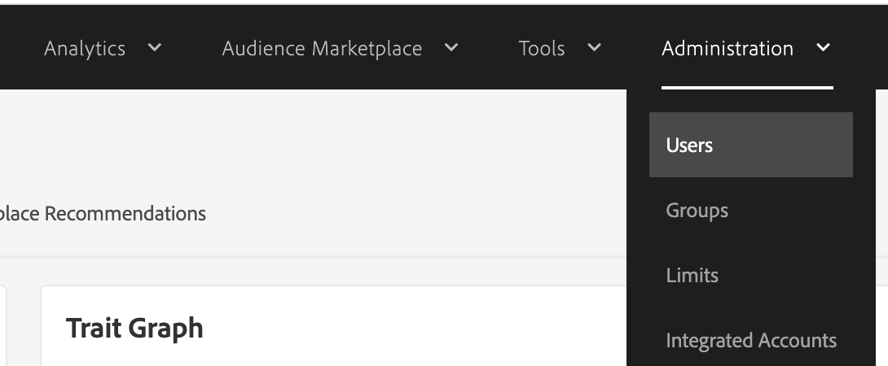

# Adobe Audience Manager中的存取問題

如果您在透過Admin Console獲得存取許可權後，在Adobe Audience Manager中遇到存取問題，請依照本文所述的步驟解決問題。

## 說明 {#description}

<b>環境</b>
Adobe Audience Manager

<b>問題/症狀</b>
如果您在Audience Manager中遇到存取問題，儘管透過Admin Console授予存取權，這些步驟將會有所幫助。

## 解決方法 {#resolution}

<b>解決方案</b>
AAM系統管理員可在Audience ManagerUI本身(非Admin Console)中完成這些步驟，以在Audience ManagerUI中授予完整、升級的管理許可權。

RBAC控制項也可用來授與更精細的許可權。

如需有關RBAC的詳細資訊，請前往此處： [管理（RBAC控制）](https://experienceleague.adobe.com/docs/audience-manager/user-guide/features/administration/administration-overview.html?lang=zh-Hant) Adobe Audience Manager使用手冊中的。

<u><b>授予AAM系統管理員許可權的步驟</b></u>

1. 導覽至管理 `>`  使用者。

   
2. 找出有問題的使用者帳戶，並啟用 <b>管理員</b> 核取方塊以授與完整AAM許可權。
