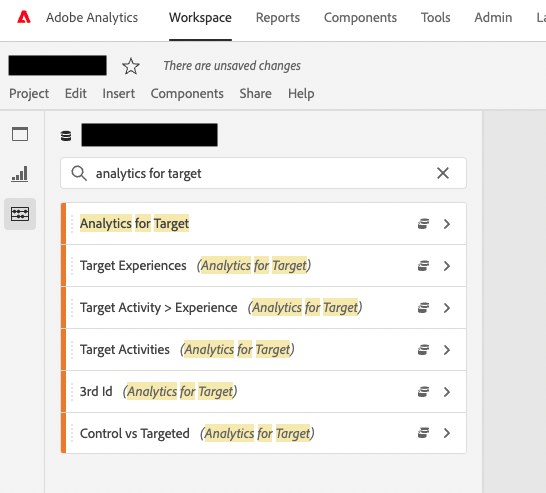

# 在 Adobe Analytics 中顯示 A4T 報表維度的權限

## 說明 {#description}

<b>環境</b>
- Customer Journey Analytics
- Analytics

     <b>問題/症狀</b>  A4T報表的Dimension若要顯示在AdobeAnalysis Workspace中，需要哪些權限？ 

## 解決方法 {#resolution}

請依照下列步驟操作：
1. 首先，選取 <b>產品設定檔</b> 的Adobe Analytics，而您想透過Admin Console授予權限。
2. 選擇 <b>Dimension</b> 在 <b>Adobe Analytics</b> 權限項目。\
   
3. 如果維度權限 <b>Analytics for Target</b> 已授予，則維度項目 <b>目標活動</b>, <b>目標體驗</b>, <b>大於體驗的目標活動</b>, <b>控制與目標</b>等項目。

- A4T報表 — Analytics中的報表 — Dimension

   https://experienceleague.adobe.com/docs/target/using/integrate/a4t/reporting.html?lang=ja&amp;mt=false#dimensions
- Adobe Analytics的產品設定檔 — Adobe Analytics權限項目

   https://experienceleague.adobe.com/docs/analytics/admin/admin-console/permissions/product-profile.html?lang=eng#dimensions

