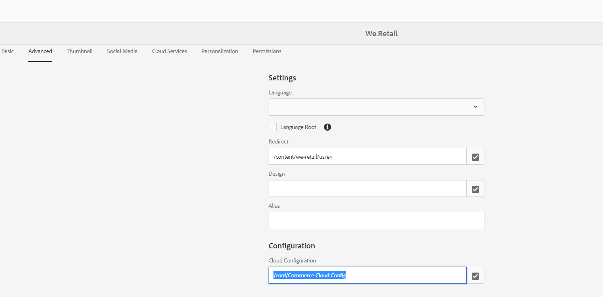

# AEM CIF整合問題。 產品未在CIF核心元件對話方塊中載入。

## 說明

產品未在CIF核心元件對話方塊中載入。 如同檔案0,AEM中的Commerce Cloud設定會在CIF雲端設定對話方塊中，將目錄根類別識別碼設為「4」，而非「2」（預設值）。  但若勾選從AEM到 [!DNL Magento] 執行其顯示 `CategoryId` 為&quot;2&quot;(defaultValue)而非&quot;4&quot;，因為產品未在CIF核心元件對話方塊中載入

0 [https://experienceleague.adobe.com/docs/experience-manager-65/commerce/storefront/getting-started.html?lang=en](https://experienceleague.adobe.com/docs/experience-manager-65/commerce/storefront/getting-started.html?lang=en)

## 解析度

若未在下方的頁面屬性上設定「Commerce Cloud設定」，則可能會發生此問題 [!UICONTROL 進階] 標籤。 通常在網站根頁面或內容樹狀結構的登陸頁面層級上設定此Commerce Cloud。

若要修正此問題，請務必在「 」中設定Commerce Cloud設定[!UICONTROL 雲端設定]&quot;欄位 [!UICONTROL 進階] 頁面屬性中的索引標籤，如下方螢幕擷取所示。

