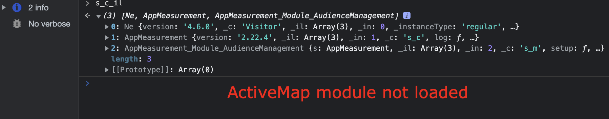

# 如何停用Active Map資料收集？

## 說明

基於某些原因，我們不想再收集Active Map資料；如何停用Active Map資料收集？
  

## 解決方法

- <b>如果Adobe Analytics程式庫是在客戶伺服器(AppMeasurement.js自行託管)上管理</b>

從AppMeasurement.js檔案中刪除AppMeasurement_Module_ActivityMap模組

- <b>如果Adobe Analytics程式庫是在Adobe端管理(透過Adobe CDN託管的AppMeasurement.js)</b>

在AEP資料收集(Launch) UI中，前往Adobe Analytics擴充功能的設定，並取消勾選方塊以停用Activity Map，然後發佈組建

- 

- <b>停用Active Map後，請檢查Active Map模組是否未透過&#39;s_c_il&#39;命令透過瀏覽器&#39;console&#39;功能表載入</b>

Active Map模組已載入

Active Map模組未載入

- <b>停用Active Map後，透過瀏覽器「網路」選單檢查Adobe Analytics伺服器呼叫</b>.

