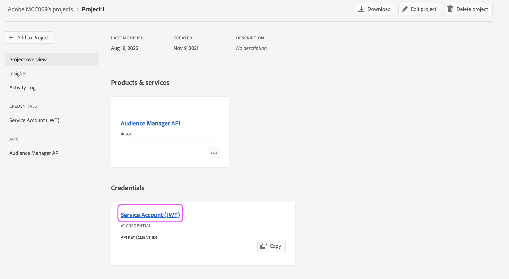

# 如何設定AAM API存取

瞭解如何在開發人員控制檯中建立專案，以產生Audience ManagerAPI JWT憑證。

## 說明 {#description}

### 環境

Adobe Audience Manager

### 問題/症狀

如何設定並產生Audience Manager API的認證？

## 解決方法 {#resolution}

您需要Admin Console中的系統管理員許可權，才能產生Audience ManagerAPI的認證。 步驟1和2概述如何授與這些升級許可權。 您目前的系統管理員可能偏好自行執行這些步驟，而不是將已升級的管理許可權授與其他使用者，在這種情況下，請直接跳至步驟3。

1. 導覽至 [Admin Console](https://adminconsole.adobe.com/) ，然後從「快速連結」選單中選取「新增管理員」：     
2. 輸入您要授與存取權之所有使用者的電子郵件。 在下一頁，選擇「系統管理員」作為許可權層級：     
3. 瀏覽至 [https://developer.adobe.com/console](https://developer.adobe.com/console) . 如果在先前步驟中授予了系統管理員許可權，您仍然沒有存取權，請嘗試重新整理您的Cookie/快取。
4. 從快速入門功能表（或頂端導覽列中的專案功能表）建立新專案：     
5. 將Audience Manager API新增至專案：     
   
6. 請依照步驟產生（或上傳）您的JWT憑證。 如果您選擇透過開發主控台產生認證，請務必安全地儲存私密金鑰。 在後續步驟中，您將需要您的私密金鑰。     
7. 接著，系統會提示您將認證指派給相關的產品設定檔。 如果您的組織使用以角色為基礎的存取控制，您將需要按照以下步驟建立技術使用者帳戶並將該帳戶新增到相關的RBAC群組： [https://experienceleague.adobe.com/docs/audience-manager/user-guide/api-and-sdk-code/rest-apis/aam-api-getting-started.html?lang=en#technical-account-rbac-permissions](https://experienceleague.adobe.com/docs/audience-manager/user-guide/api-and-sdk-code/rest-apis/aam-api-getting-started.html?lang=en#technical-account-rbac-permissions)
8. 完成這些步驟後，您可以產生存取權杖來提出您的第一個API請求。 首先，在開發主控台中按一下您的認證總覽頁面：     
9. 按一下頁面頂端的「產生JWT」索引標籤，然後從步驟6下載的檔案中貼入整個私密金鑰，然後按一下「產生權杖」：     

最後，您可以利用上一步中擷取的存取權杖來提出API請求。 您可以透過cURL命令，從任何API平台(例如Postman)直接進行呼叫，甚至可以從我們的API檔案頁面進行呼叫： [https://bank.demdex.com/portal/swagger/index.html#/](https://bank.demdex.com/portal/swagger/index.html#/)

若要使用檔案中的示範功能進行呼叫，請按照上述步驟產生您的Token，然後按一下頁面右側的「授權」並輸入您的Token：

同時請務必選取aam.adobe.io伺服器，如上方熒幕擷圖所示。 現在，您可以透過輸入相關引數並按一下「試用」按鈕，利用任何API請求的示範功能：

請記住，這會將真正的API請求傳送給您的執行個體。 如果您利用DELETE、PUT或POST請求，您可能會對執行個體進行非預期的變更。 在傳送請求之前，請務必仔細閱讀每一個API呼叫的檔案。
