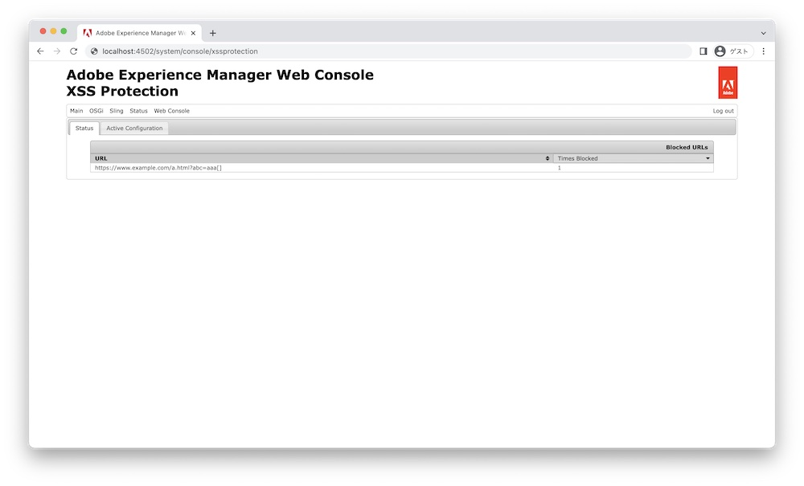

# 如何檢查被XSS保護封鎖的URL | AEM

瞭解如何使用本文所述的步驟，檢查Adobe Experience Manager中跨網站指令碼(XSS)保護封鎖的URL。

## 說明 {#description}

### <b>環境</b>

Adobe Experience Manager

### <b>問題/症狀</b>

如果您遇到未在Adobe Experience Manager (AEM)的頁面上呈現連結URL的問題，可能是因為跨網站指令碼(XSS)保護所造成。 此安全性功能可防止顯示可能導致XSS攻擊的無效URL。 若要疑難排解此問題，可檢查XSS保護功能已封鎖的URL。
本文提供如何執行此動作的逐步指示。

如需有關的詳細資訊，請參閱AEM 6.5安全性使用指南 [XSS保護](https://experienceleague.adobe.com/docs/experience-manager-65/developing/introduction/security.html)

## 解決方法 {#resolution}

依照以下步驟檢查封鎖的URL：

1. 前往 <b>網頁主控台</b> `>`  <b>Sling</b> `>`  <b>XSS保護</b> (或存取http://localhost:4502/system/console/xssprotection)

2. 檢查 *URL* 和 *封鎖的時間* 「狀態」標籤中「封鎖的URL」下的值

   

