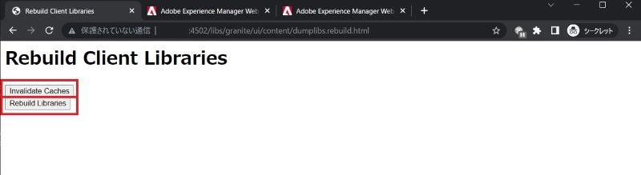

# Adobe Experience Manager：如何清除自訂元件的HTL/JSP/JS/CSS快取

當您修改自訂元件的HTL/JSP/JS/CSS檔案時，AEM可能不會立即反映使用元件對頁面所做的修改。 原因必須是內部快取，本文會幫助您瞭解如何清除這些檔案的快取。

## 說明 {#description}

### <b>環境</b>

Experience Manager 6.5

### 問題/症狀

當您修改自訂元件的HTL/JSP/JS/CSS檔案時，AEM可能不會立即反映使用元件對頁面所做的修改。 在這種情況下，內部快取可能是原因。
瞭解如何清除這些檔案的快取。

## 解決方法 {#resolution}

您可以透過下列函式清除快取：

1. 使用者端資料庫：JS/CSS檔案

   重建使用者端資料庫>使快取無效或重建資料庫

      http://localhost:4502/libs/granite/ui/content/dumplibs.rebuild.html 

        
2. 檔案系統類別載入器：JSP、HTL

   Web主控台> Sling >檔案系統類別載入器>清除類別載入器

      http://localhost:4502/system/console/fsclassloader

        
3. 指令碼快取： HTL、JS檔案

   「網頁主控台」 > 「Sling」 > 「指令碼快取狀態」 > 「清除快取」

      http://localhost:4502/system/console/scriptcache

        

建議在安靜的時間清除快取，以避免效能降低。
您可能需要檢查Dispatcher快取和瀏覽器快取。
