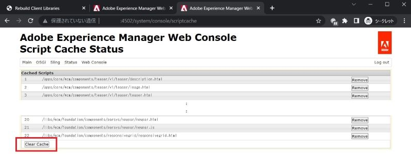

# Adobe Experience Manager:如何清除自訂元件的HTL/JSP/JS/CSS快取

## 說明

當您修改自訂元件的HTL/JSP/JS/CSS檔案時，AEM可能不會立即反映對元件所做頁面的修改。 在這種情況下，內部快取可能是原因。
本文說明如何清除這些檔案的快取。

<b>環境：</b>
AEM 6.5

## 解析度

您可以透過下列函式來清除快取。

\*客戶端庫：JS/CSS檔案

重建客戶端庫>使快取無效或重建庫http://localhost:4502/libs/granite/ui/content/dumplibs.rebuild.html 
     

\*檔案系統類載入器：JSP、HTL

Web控制台> Sling >檔案系統類載入器>清除類載入器http://localhost:4502/system/console/fsclassloader
     

\*指令碼快取：HTL、JS檔案

Web主控台> Sling >指令碼快取狀態>清除快取http://localhost:4502/system/console/scriptcache
     

建議您在安靜的時間執行快取清除，以避免效能降低。
您也可能需要檢查Dispatcher快取和瀏覽器快取。
