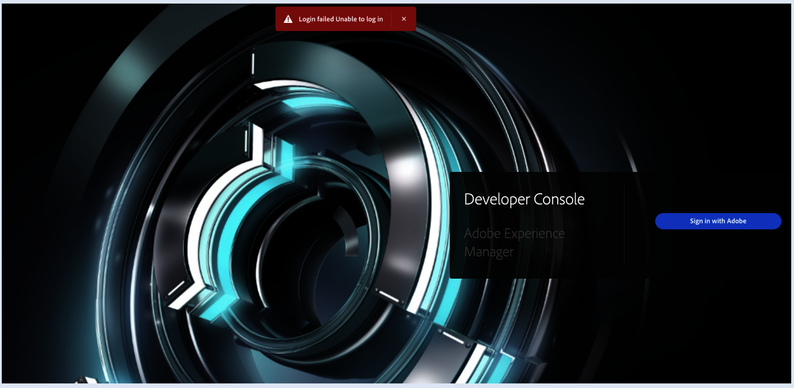

# 儘管有許可權，仍無法存取AEM開發人員主控台

如果您的團隊儘管擁有必要的許可權，仍無法存取AEM Developer Console，請檢查角色是否透過群組提供。 從使用者群組中移除角色，並將其直接指派給使用者。

## 說明 {#description}

### 環境

Adobe Experience Manager

### 問題/症狀

您和您的團隊成員看到 *登入失敗無法登入* 嘗試為所有環境登入AEM開發人員控制檯時發生錯誤，儘管您擁有開發人員、管理員和計畫管理員等必要許可權。

## 解決方法 {#resolution}

管理員應檢查角色是否透過使用者群組提供。 前往Admin Console `>`  <b>使用者</b>. 如果角色是透過使用者群組共用，您會看到 <b>指派者 `<` user_group_name`>`  使用者群組</b>.

不過，AEMas a Cloud Service不支援巢狀群組。 此外，雖然透過IMS使用者群組指派的產品許可權應該受到AEMas a Cloud Service的支援，但IMS並非總是可靠的繼承。 管理員應該從使用者群組中移除角色，並將它們直接指派給使用者。
