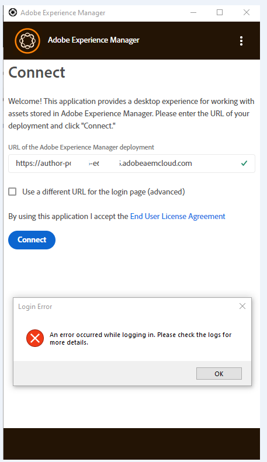

# AEM案頭應用程式在連線後顯示空白頁面


嘗試登入AEM案頭應用程式時，會傳回錯誤訊息： *登入時發生錯誤。 請檢視記錄檔以取得詳細資訊*，這是因為Proxy正嘗試封鎖對AEM作者的存取權。 繞過Proxy之後，將會解決錯誤。

## 說明 {#description}


下載並安裝AEM案頭應用程式後，每當客戶嘗試連線至作者URL時，都會收到登入錯誤：

「登入時發生錯誤。 請檢視記錄檔以取得詳細資訊。」



記錄檔中出現下列錯誤：

<b>backend.log：</b>

`error: [ aemdesktop]  native application received error loginerror: AssetError: tunneling socket could not be established, statusCode=407`

<b>request.log：</b>


```
error: [ check_login]  < ERR GET https://author-p67006-e643795.adobeaemcloud.com/content/dam.json message=tunneling socket could not be established, statusCode=407, stack=Error: tunneling socket could not be established, statusCode=407
    at ClientRequest.onConnect (C:\Program Files\Adobe\Adobe Experience Manager Desktop\javascript\node_modules\tunnel-agent\index.js:166:19)
    at Object.onceWrapper (events.js:320:30)
    at emitThree (events.js:135:13)
    at ClientRequest.emit (events.js:216:7)
    at Socket.socketOnData (_http_client.js:486:11)
    at emitOne (events.js:115:13)
    at Socket.emit (events.js:210:7)
    at addChunk (_stream_readable.js:252:12), code=ECONNRESET
```


<br>

## 解決方法 {#resolution}


記錄檔中的錯誤表示連線錯誤。

客戶使用的Proxy已封鎖透過AEM案頭應用程式存取AEM作者。 繞過Proxy之後，客戶就能成功連線
