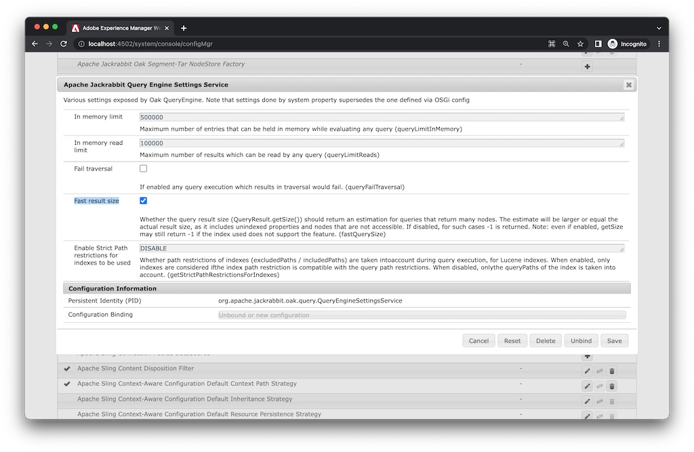

# Adobe Experience Manager:點擊數看起來不正確時如何檢查設定

## 說明

當實際的搜索結果數與查詢的點擊數不同時，fastQuerySize選項可設定為enabled(true)。
 啟用fastQuerySize選項有多種方式。 本文說明如何設定每種方式。
  

## 解析度

<b>OSGi配置</b>:Web控制台>配置> Apache Jackrabbit查詢引擎設定服務>快速結果大小

http://localhost:4502/system/console/configMgr/org.apache.jackrabbit.oak.query.QueryEngineSettingsService檢查「快速結果大小」並保存。
   

<b>Java配置</b>:-Doak.fastQuerySize=true

在AEM開始指令碼(crx-quickstart/bin/start)中新增以下系統屬性。
        CQ_JVM_OPTS=&quot;${CQ_JVM_OPTS} -Doak.fastQuerySize=true&quot;

此設定會覆寫OSGi設定。
    

<b>JMX</b>:Web主控台> JMX > org.apache.jackrabbit.oak:設定(QueryEngineSettings)

http://localhost:4502/system/console/jmx/org.apache.jackrabbit.oak%3Aname%3Dsettings%2Ctype%3DQueryEngineSettings將「快速結果大小」變更為true並儲存。

JMX處的此配置值將覆蓋其他配置。 重新啟動AEM會重設值。

