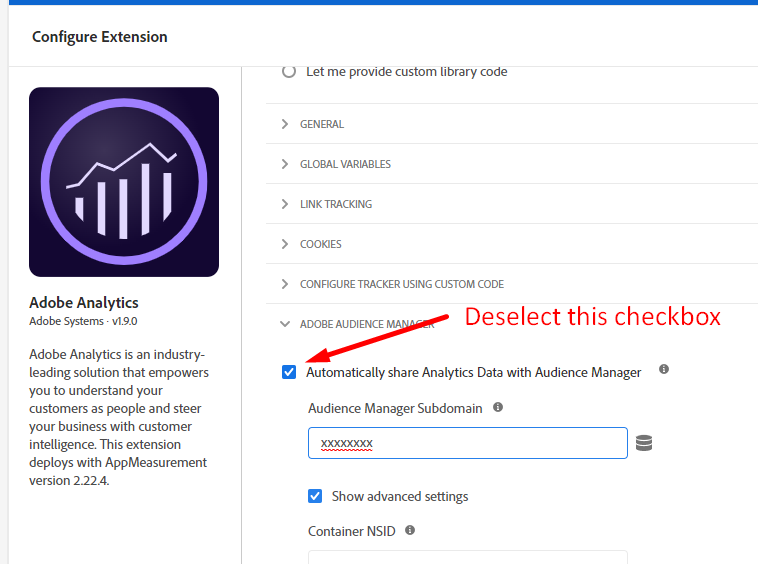

# 如何移除Audience Manager呼叫

## 說明 {#description}

如何移除所有伺服器呼叫或資料流入Audience Manager。

## 解析度 {#resolution}

您可以從以下位置刪除Audience Manager的關聯，從而完全刪除該關聯：

1. 移除DIL代碼
2. 移除Adobe Analytics程式庫中的伺服器端轉送
3. 取消發佈所有Analytics區段
4. 在Adobe Campaign中停止匯入/匯出工作流程
5. 停止Adobe Target呼叫
6. 停止DCM記錄擷取、第三方像素呼叫
7. 停止所有目的地與任何第二方或第三方共用資料
8. 停止所有離線資料擷取

<b>移除DIL代碼</b>

1. 在程式碼中，識別下列函式並將其移除：

   1. DIL.create
   2. DILinstance.api.signals().submit()
   3. DIL.modules.siteCatalyst.init如果您要將資料轉送至Adobe Analytics
   4. GA.submitUniversalAnalytics();或GA.submitUniversalAnalytics();  如果您要將資料轉送至Google Analytics
2. 移除上述函式後，請確定您也從程式碼中移除了DILJS程式庫。

<b>結果</b>:重新發佈並重新載入您的網站，您不應將任何呼叫顯示為 [https://subdomain.demdex.net/event....](https://subdomain.demdex.net/event?....)

<b>移除伺服器端轉送</b>

1. 前往已啟用伺服器端轉送的Analytics報表套裝，並停用核取方塊。

 

1. 完成上述步驟後，前往您的AppMeasurement.js程式碼並移除下列程式碼，或是如果您有Launch，只要取消選取「Audience Manager轉送」核取方塊即可。

             
<b>結果</b>:Analytics呼叫回應應為空。

<b>取消發佈所有Analytics區段</b>
前往已發佈和取消發佈的個別Analytics區段。
<b>結果</b>:離線區段共用將從Analytics停止至Audience Manager。

<b>在Adobe Campaign中停止匯入/匯出工作流程</b>
從Audience Manager:從促銷活動刪除您的所有促銷活動目的地：從Campaign UI刪除或完全停止匯入/匯出工作流程。
<b>結果</b>:將停止從「對象」到「促銷活動」的區段間對應。

<b>停止Adobe Target呼叫</b>
聯絡您的CSM或客戶經理，讓布建團隊停用「共用對象」或「人員核心服務」功能。
<b>結果</b>:Target不會對Audience Manager進行額外呼叫。

<b>停止DCM記錄擷取、第三方像素呼叫</b>
如果您已啟用DCM記錄擷取，請停止此作業，且不要上傳任何其他中繼資料檔案。
如果您在任何地方都有作用中的曝光/點按/轉換像素，請也停止。
<b>結果</b>:無第三方資料收集。

<b>停止所有目的地與任何第二方或第三方共用資料</b>
可直接從UI停止URL和Cookie目的地。
若為S2S目的地，您可以聯絡以支援完全停止目的地。
<b>結果</b>:不會從Audience Manager中共用任何資料。

<b>停止所有離線資料擷取</b>
如果您要將任何資料檔案上傳至Audience Manager，請立即停止。
<b>結果</b>:不會上傳離線資料。
