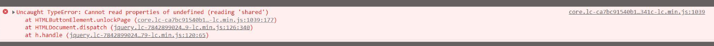

# 頁面解鎖選項無法運作

## 說明 {#description}

嘗試透過頁面側邊欄 (圖 1) 鎖定/解鎖頁面時，客戶只能鎖定它。當他們嘗試解鎖時，他們會看到錯誤 (圖 2)，且無法解鎖該頁面。 但是，他們可以透過網站 Admin Console 3 成功鎖定/解鎖頁面。   圖 1    圖 2    圖 3

## 解決方法 {#resolution}

嘗試解鎖頁面失敗時出現錯誤 1，因為該頁面不包含「cq.shared」用戶端資料庫。

若要解決此問題，客戶需要對此 clientlibs 建立相依性，以便為他們的自訂內容頁面載入它。

1 core.lc-ca7bc91540b118ca20ea6d0db684341c-lc.min.js:1039

未擷取的類型錯誤：無法在以下檔案讀取未定義的屬性 (讀取「共用」)：HTMLButtonElement.unlockPage (core.lc-ca7bc91540b118ca20ea6d0db684341c-lc.min.js:1039:177)、HTMLDocument.dispatch (jquery.lc-7842899024219bcbdb5e72c946870b79-lc.min.js:126:340)、h.handle (jquery.lc-7842899024219bcbdb5e72c946870b79-lc.min.js:120:65)
