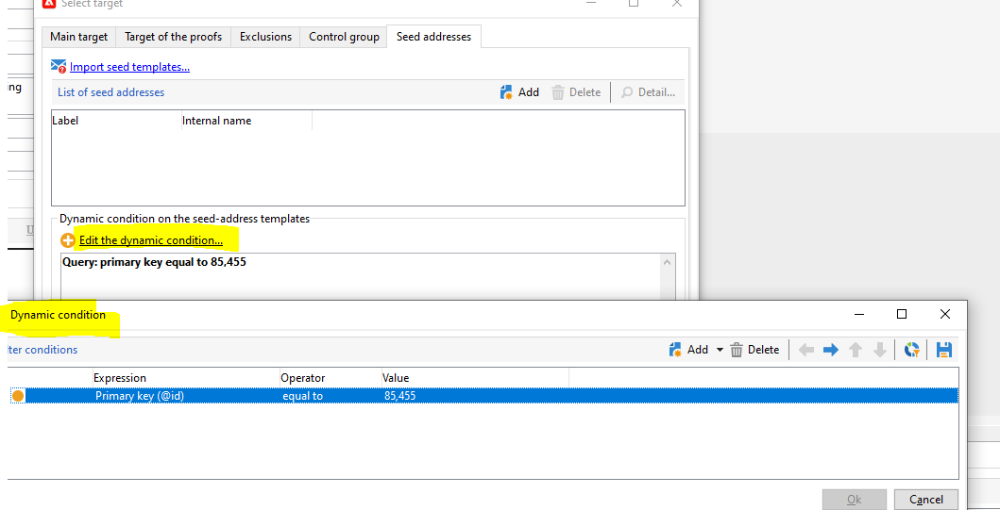

# 執行定期傳送時，種子地址會重複

## 說明 {#description}

<b>環境</b>

- Adobe Campaign

- Adobe Campaign Classic

<b>問題/症狀</b>

當客戶在定期傳送中加入新的種子地址時，每次執行定期傳送時，就會建立新的傳送執行個體，也會建立新的種子地址 (具有相同特徵，但 ID/內部名稱不同)。

要重現問題：

1. 建立新的活動並在其工作流程下加入新的定期傳送。

2. 在新的定期傳送中，加入新的種子地址並儲存。在種子地址資料夾下，檢查是否已建立新種子地址。
3. 執行循環傳送。 這會建立用於新傳送例項的重複種子地址。

## 解決方法 {#resolution}

運作成效符合預期。改善請求目前處於作用中狀態 [NEO-12892](https://jira.corp.adobe.com/browse/NEO-12892) 來改變。

同時，客戶應使用具有動態條件的種子以避免重複：

