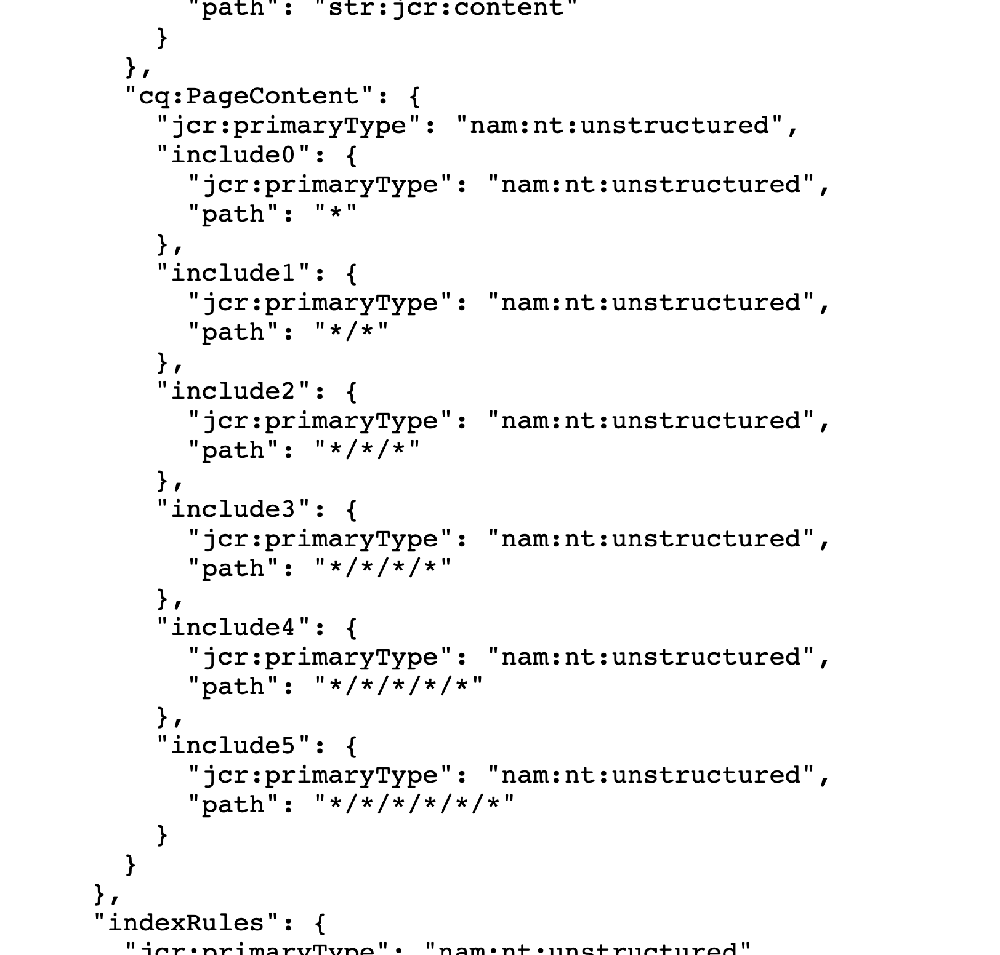

# Adobe Experience Manager:傳入的連結不會顯示所有連結頁面

## 說明 {#description}

如果含有連結的節點距離其頁面的jcr:content處於4個以上的層級，則該頁面將不會顯示在連結目標的傳入連結中。

·當連結頁面顯示在傳入連結中時：  /content/wknd/us/en/link-page/jcr:content 1)/root 2)/container 3)/container 4)/text(link

·當連結頁面未顯示在傳入連結中時：  /content/wknd/us/en/link-page/jcr:content 1)/root 2)/container 3)/container 4)/container 5)/text(link

<b>環境</b>
AEM as a Cloud Service，AEM 6.5

## 解決方法 {#resolution}

使用CRXDE Lite檢查包含連結的節點階層。

檢閱頁面結構並加以調整，使連結節點可位於淺層。
如果連結節點的級別保持在深層級別，則調整索引以增加要為傳入連結搜索建立索引的級別。

使用CRX/DE Lite，選取/oak:index/cqPageLucene/aggregates/cq:PageContent。
  建立新節點，並新增表示所需階層層級的「path」屬性。

- 在以下範例中，新增了「include4」和「include5」，以增加最多6個傳入連結的搜尋層級。

若要執行重新索引，請將/oak:index/cqPageLucene的重新索引屬性值變更為true並儲存。

  
     — 重新索引完成後，error.log中會顯示下列訊息。

`    13.01.2023 12:00:45.264 *INFO* async-index-update-async org.apache.jackrabbit.oak.plugins.index.AsyncIndexUpdate async Reindexing completed for indexes: /oak:index/cqPageLucene*(788) in 733.7 ms (733 ms)`

重新索引可能會造成效能問題。
    建議將重新索引任務安排在相對安靜的時間。
