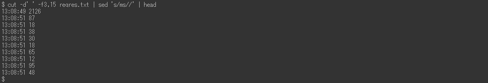

# Adobe Experience Manager:request.log分析範例

## 說明 {#description}

AEM request.log包含分析效能問題的各種有用資訊，例如回應時間。 以下是使用Linux命令（包括一些外部命令）的分析示例清單。

<b>環境</b>
AEM 6.5、Linux(Bash)

## 解決方法 {#resolution}

目錄：  
<b>簡介</b>
  request.log的格式

<b>準備</b>
  步驟1. 資料清理步驟2. 重新啟動時間步驟3。 每小時訪問次數步驟4。 最大併發處理步驟5。 分割記錄檔步驟6。 合併請求記錄和響應記錄

<b>分析範例</b>
  範例1. 最重的存取範例2。 訪問缺少響應示例3。 慢速訪問示例4。 響應時間的時間序列資料示例5。 最小、平均（平均）、中位數、最大回應時間範例6。 每個時段的存取次數範例7。 每個期間的回應狀態數範例8。 最常見的URL範例9。 request.log記錄的access.log記錄

<b>結論</b>

 簡介  request.log的格式  
AEM 6.5依預設會以下列格式產生request.log。 由於系統的限制，本文中的命令行顯示為影像，而不是純文字。

request.log範例：

在本文中，我是指「 — 」作為「要求記錄」的行。 帶有「 — 」的行是「回應記錄」。

<b>請求記錄</b>
  AEM收到請求時，會記錄請求記錄。 它包含接收的日期和時間、請求ID、請求方法和URL。

<b>回應記錄</b>
  AEM回應請求時，會記錄回應記錄。 它包含回應的日期和時間、要求ID、狀態代碼、內容類型，以及回應時間（以毫秒為單位）。

另請參閱相應的手冊：https://experienceleague.adobe.com/docs/experience-manager-65/deploying/configuring/monitoring-and-maintaining.html?lang=en#interpreting-the-request-log

 準備  步驟1. 資料清理  
在深入分析request.log之前，請務必標準化記錄。

第一個sed命令移除回應記錄的Content-Type中的額外空格，以防止以空白字元分離錯誤欄位。 ruby命令將日期格式轉換為ISO 8601。 ruby命令還用空格（而不是冒號）分隔日期和時間。

 步驟 2.重新啟動時間  
重新啟動AEM和Service Pack安裝會重設request.log的要求ID。 請求ID = 0的請求記錄表示可能有這類操作。

在上述範例中，請求ID在13時重設為0:08:β:26:13.

 步驟 3.每小時訪問次數  
計算每小時的存取次數以及request.log的時間範圍。

           
 步驟4. 最大併發處理  
同時處理的數量有助於猜測AEM的伺服器負載。

依預設，AEM中Jetty的同時連線數上限設為200。 完成響應後釋放套接字時出現延遲。 當同時處理的數量超過約170個時，就無法接受新請求。

 步驟 5.分割記錄檔  
當AEM重新啟動或安裝Service Pack時，request.log的要求ID會重設。 由於此行為，當request.log包含此類操作時，分析可能會不正確。 為了執行精確分析並減少一次處理的檔案大小，請使用請求ID = 0的請求記錄來分割request.log。

 步驟 6.合併請求記錄和響應記錄  
依請求ID合併請求和回應記錄，可讓您在效能問題開始時更容易發現。 在後面的範例中，我會使用此合併的記錄檔。

最後使用的命令向沒有相應響應記錄的請求記錄添加虛擬響應。 也可能有沒有請求記錄的響應記錄。 但它們是可忽略的，因為它們通常不是調查的問題。

合併的記錄檔應如下所示：

           
 分析範例  範例1. 最重的通道  
依回應時間以降序排序合併的記錄檔，包括未回應的存取。

              
 範例2. 存取遺失的回應  
提取使用虛擬響應時間訪問缺少其相應響應記錄。

如果沒有響應的接收訪問的定時與伺服器負載的增加相關，則這些訪問可能已觸發效能問題。

                                
 範例3. 慢速存取  
擷取需要超過10秒的存取。

當點擊數過高時，請在grep命令中將0-9{5}替換為0-9{6}，以縮小到超過100秒的存取。

 範例 4. 響應時間的時間序列資料  
僅從資料中擷取時間戳記和回應時間對於建立圖形很有幫助。

省略立即回應的存取，可讓資料更有效率。 以下示例提取了超過一秒的訪問。

                    
 範例5. 最小、平均（平均）、中位數、最大回應時間  

上述範例使用datamash命令(https://www.gnu.org/software/datamash/)進行統計處理。 如果日誌包含沒有響應的訪問，則虛值將影響結果。

 範例6. 每個時段的訪問次數  
計算每10分鐘的存取次數。 結果有助於判斷大流量是否造成效能問題。

下列範例會將資料縮小至僅限POST請求。 一般的使用案例是判斷內容製作或復寫是否集中在「發佈」層級。

        
 範例7. 每個期間的回應狀態數  
使用datamash命令建立每10分鐘每個響應狀態數的表。

           
 範例8. 最頻繁的URL  
列印每10分鐘存取頻率最高的前三個URL。

                       
 範例9. request.log記錄的access.log記錄  
搜尋access.log ，以尋找對應至特定請求ID的記錄。

如果同時發生多次存取相同的URL，結果會顯示單一請求ID的多個access.log記錄。

 結論  
我希望本文中的範例能協助您分析效能問題。

列出的示例已在CentOS 7.5和Ubuntu 22.04LTS上進行了測試，但根據您的環境，如不同版本或命令的變化，它們可能無法按預期工作。 請根據您環境中安裝的命令相應地調整它們。

