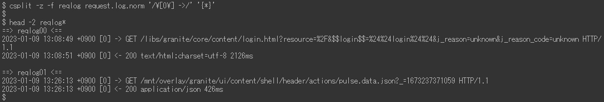

# Adobe Experience Manager：request.log 分析範例

## 說明 {#description}

該 AEM request.log 包含各種實用的資訊，例如回應時間，可用於分析效能問題。以下是使用 Linux 命令 (包括一些外部命令) 的分析範例清單。

<b>環境</b>
AEM 6.5，Linux(Bash)

## 解決方法 {#resolution}

<b>目錄：</b>

簡介
 request.log 的格式

準備
  步驟 1. 資料清理
 步驟 2.重新啟動的時間
 步驟 3.每小時存取次數
  步驟 4. 同時處理的最大值
 步驟 5.分割記錄檔
  步驟 6. 合併要求記錄和回應記錄

分析範例
  範例 1. 最大量存取
 範例 2.缺少回應的存取
  範例 3. 慢速存取
  範例 4.回應時間的時間序列資料
  範例 5.回應時間最小值、中間值 (平均)、中位值、最大值
  範例 6.一段時間內的存取次數
  範例 7.一段時間內的回應狀態次數
  範例 8.最常見的 URL
  範例 9.request.log 紀錄的 access.log 記錄

結論

<b>簡介</b>

<u>request.log 的格式</u>

預設情況下，AEM 6.5 會以下列格式產生 request.log。由於系統限制，本文中的命令列以影像顯示而非純文字。

request.log 的範例：

在本文中，我將包含「-」的行稱為「要求記錄」。包含「-」的行指「回應記錄」。

要求記錄
  當 AEM 收到要求時，會記錄一筆要求記錄。記錄中會包含接收日期和時間、要求 ID、要求方法和 URL。

回應記錄
  當 AEM 回應要求時，會記錄一筆回應記錄。記錄中會包含回應的日期和時間、要求 ID、狀態代碼、內容類型和回應時間 (以毫秒為單位)。

另見參閱相對應的手冊：
https://experienceleague.adobe.com/docs/experience-manager-65/deploying/configuring/monitoring-and-maintaining.html?lang=en#interpreting-the-request-log

<b>準備</b>

<u>步驟 1.資料清理</u>

在深入分析 request.log 之前，將記錄標準化非常重要。

第一個 sed 命令會在回應記錄的內容類型中移除一個額外的空格，以防止以空格分隔的錯誤欄位。Ruby 命令會將日期格式轉換為 ISO 8601。Ruby 命令還會用空格取代冒號來分隔日期和時間。

<u>步驟 2.重新啟動的時間</u>

重新啟動 AEM 和 Service Pack 安裝會重設 request.log 的要求 ID。包含 Request ID = 0 的要求記錄表示可能有這類型操作。

在上面的範例中，在 13:08:49 和 13:26:13 處將要求 ID 重設為 0。

<u>步驟 3.每小時存取次數</u>

計算每小時的存取次數和 request.log 的時間範圍。

<u>步驟 4.同時處理的最大值</u>

同時處理的數量有助於猜測 AEM 的伺服器負載。

預設情況下，將 AEM 中 Jetty 的最大同時連線數設定為 200。完成回應後解除通訊端時發生延遲。當同時處理的數量超過約 170 時，它會變得無法接受新的要求。

<u>步驟 5.分割記錄檔</u>

AEM 重新啟動或安裝 Service Pack 時，會重設 request.log 的要求 ID。由於此行為，當 request.log 包含這類操作時，分析可能不正確。為了執行準確的分析並縮小一次處理的檔案大小，請使用要求 ID = 0 的要求記錄來分割 request.log。

<u>步驟 6.合併要求記錄和回應記錄</u>

依據要求 ID 來合併要求和回應記錄能因此更容易在效能問題開始時即刻發現。我將在後面的範例中使用這個合併的記錄檔。

最後一個 sed 命令會將虛擬回應新增到沒有相對應回應記錄的要求記錄中。也可能有不包含要求記錄的回應記錄。但這類記錄可忽略，因為這些通常不是需要調查的問題。

合併的紀錄檔應該如下所示：

<b>分析範例</b>

<u>範例 1. 最大量存取</u>

將合併後的記錄檔依據回應時間以遞減順序排序，包括沒有回應的存取。

<u>範例 2. 缺少回應的存取</u>

使用虛擬回應時間來擷取缺少相對應回應記錄的存取。

如果在沒有回應的情況下接收存取的時間與伺服器負載的增加相互關聯，則這些存取可能已經觸發了效能問題。

<u>範例 3.慢速存取</u>

擷取花費 10 秒以上的存取。

當點擊次數過高時，將 grep 命令中的 0-9{5} 替換為 0-9{6}，以將範圍縮小到花費 100 秒以上的存取。

<u>範例 4. 回應時間的時間序列資料</u>

從資料中僅擷取時間戳記和回應時間有助於建立圖表。

省略立即回應的存取使得資料更有效率。以下範例擷取花費超過一秒的存取。

<u>範例 5. 回應時間最小值、中間值 (平均)、中位值、最大值</u>

以上範例使用 datamash 命令 (https://www.gnu.org/software/datamash/) 進行統計處理。如果紀錄中包含無回應的存取，則虛擬值將影響結果。

<u>範例 6. 一段時間內的存取次數</u>

計算每十分鐘的存取次數。此結果有助於確定大流量是否導致了效能問題。

以下範例將資料範圍縮小到僅限 POST 要求。一個典型的使用案例是確定內容製作或複製是否集中到發佈階層。

<u>範例 7. 一段時間內的回應狀態次數</u>

使用 datamash 命令建立每十分鐘每個回應狀態數的表格。

<u>範例 8. 最常見的 URL</u>

列印每十分鐘存取最頻繁的前三大 URL。

<u>範例 9. request.log 紀錄的 access.log 記錄</u>

在 access.log 中搜尋和特定要求 ID 相對應的記錄。

如果同時多次存取同一個 URL，結果會顯示單一要求 ID 的多筆 access.log 記錄。

<b>結論</b>

我希望本文中的範例有助於您分析您的效能問題。

清單中的範例已經在 CentOS 7.5 和 Ubuntu 22.04LTS 上進行了測試，但它們可能無法按預期運作，實際情況會依據您的環境而定，例如不同版本或命令的變化。因此請根據您環境中安裝的命令對其進行調整。

