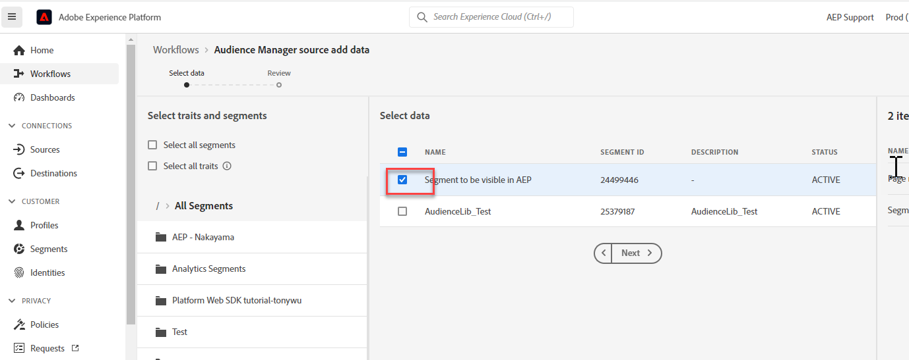

# 錯誤：由於已啟用區段共用，不允許刪除

瞭解如何解決您嘗試刪除AAM (Adobe Audience Manager)中的特徵或區段的問題。

## 說明 {#description}

### <b>環境</b>

- Audience Manager
- Experience Platform

### <b>問題/症狀</b>

嘗試刪除AAM (Adobe Audience Manager)中的特徵或區段時，就會發生此錯誤。 此錯誤的原因是，因為特徵或區段是從Audience Manager共用到AEP (Adobe Experience Platform)。

以下指定的步驟將有助於解決以下錯誤： 」*不允許刪除，因為已啟用區段共用」*

## 解決方法 {#resolution}

請依照下列步驟執行： 

1. 導覽至 <b>來源</b> 按AEP中的標籤，然後開啟Audience Manager來源聯結器的設定：

   

2. <b>取消核取</b> 您嘗試從AAM刪除的區段：

   
3. 取消勾選區段或特徵後，請按一下 <b>下一個</b> 在右上角。 在產生的頁面上，檢閱您的變更並按一下 <b>已完成</b>.

如果您要將所有區段和特徵從AAM共用至AEP，您需要更新設定以共用特定區段或停止共用資料，才能刪除AAM區段。

