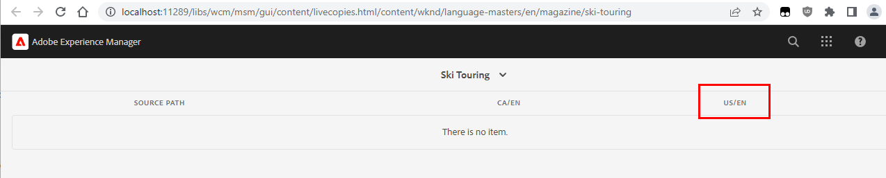

# 轉出內部即時副本期間未更新參考

## 說明 {#description}

<b>說明</b> :

當有某些巢狀/內部即時副本時，在轉出期間頁面內容中的參考將不會更新為其即時副本的對等項目（而會參照Blueprint路徑）。

由於以下多個原因，可建立內部Live Copy:

- 手動建立（「建立即時副本」）
- 或從即時副本根編輯子頁面的「即時副本」屬性

例如，考量到WKND範例網站，具有下列BluePrint/LiveCopy結構：

- Blueprint :/content/wknd/language-masters/en

- Live Copy :/content/wknd/us/en和/content/wknd/ca/en

現在，如果開啟「/content/wknd/us/en/magazine/ski-touring」頁面的「頁面」屬性（「/content/wknd/us/en」 Live Copy中的子頁面）。

前往「Live Copy」標籤並變更任一屬性（「Live Copy繼承」、「從父項繼承轉出設定」……）將建立內部Live Copy。

從「/content/wknd/us/en/magazine/ski-touring/jcr:content/cq:LiveSyncConfig」的出現/建立「cq:LiveSyncConfig」即可看到這點。

「Blueprint即時副本」控制面板（前往BP頁面屬性Blueprint即時副本概觀）也會從以下變更：

到:

## 解決方法 {#resolution}

若要在內部Live Copy上正確重寫參照，必須為MSM更新動作啟用特定設定，才能「在巢狀LiveCopy間更新參照」。

請參閱對應的檔案：

[https://experienceleague.adobe.com/docs/experience-manager-cloud-service/content/sites/administering/reusing-content/msm/live-copy-sync-config.html?lang=en#configuring-synchronization-for-updating-references](https://experienceleague.adobe.com/docs/experience-manager-cloud-service/content/sites/administering/reusing-content/msm/live-copy-sync-config.html?lang=en#configuring-synchronization-for-updating-references)

[https://experienceleague.adobe.com/docs/experience-manager-65/administering/introduction/msm-sync.html?lang=en#configuring-synchronization-for-updating-references](https://experienceleague.adobe.com/docs/experience-manager-65/administering/introduction/msm-sync.html?lang=en#configuring-synchronization-for-updating-references)

操作包括部署OSGi配置檔案或在適用時從OSGi Web控制台執行更改：
1. 存取Web主控台OSGi設定(http://localhost/system/console/configMgr)
2. 搜尋「CQ MSM參考更新動作(com.day.cq.wcm.msm.impl.actions.ReferencesUpdateActionFactory)」
3. 啟用「在巢狀LiveCopy間更新參考」核取方塊
