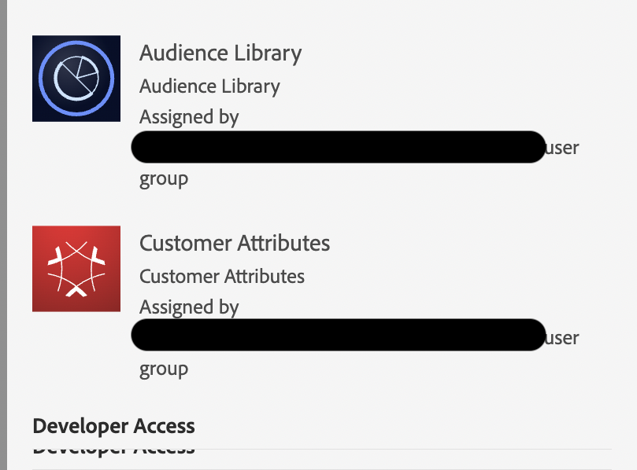

# 未預期的AAM UI存取

## 說明 {#description}

<b>環境</b>

- Audience Manager
- 客戶屬性
- 對象庫

<b>問題/症狀</b>

雖然使用者沒有特定的AAM權限，但可以存取AAM UI

## 解決方法 {#resolution}

這是由於客戶屬性和受眾程式庫權限的緣故：

後端採用Audience Manager技術，以便客戶屬性和受眾程式庫正常運作，因此會授予有限的AAM權限集與這些權限集。 因此，如果您不想讓使用者存取AAM UI，您也需要移除其受眾程式庫和客戶屬性權限。
