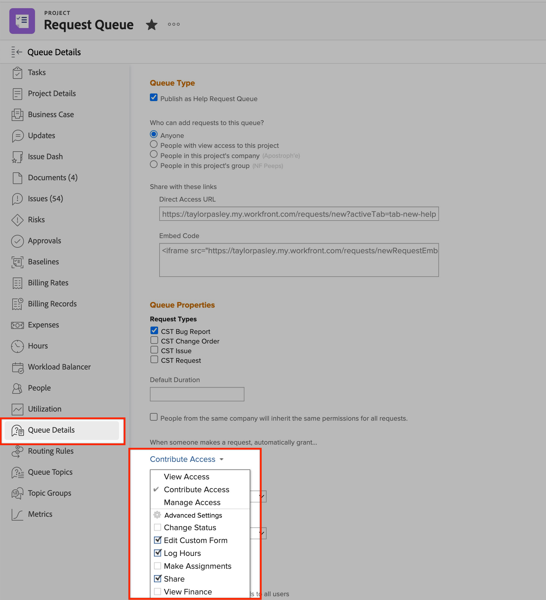

# 無法編輯自訂欄位 | Workfront

瞭解如何在Workfront上編輯自訂欄位，步驟如下。

## 說明 {#description}

### <b>環境</b>

Workfront

### <b>問題/症狀</b>

在某些情況下，使用者在編輯自訂欄位時可能會遇到問題。 例如，提交請求時、檢視物件上的自訂表單時，或檢視報表上的自訂欄位時。

## 解決方法 {#resolution}

<b>要解決的步驟：</b>
1. 確定包含欄位的表單已附加至要編輯的物件。
   1. 如果非管理員使用者想要將表單附加到物件，他們將需要管理對物件的存取權才能附加表單。
2. 確認表單共用中的所有詳細資料正確無誤。
   1. 開啟 <b>共用</b> 表單附加至的物件設定。 請參閱下文：
   2. 在「 」上尋找受影響的使用者 <b>共用</b>功能表。
      - 如果未列出使用者，請將他們新增至 <b>共用</b> 功能表。
   3. 確保使用者擁有 <b>Contribute</b> 具有的許可權 <b>編輯自訂表格</b> 在中啟用 <b>進階設定。 </b>請參閱下文：
   4. <b>（此步驟為選用） </b>如果此表單屬於<b> 請求佇列， </b>檢查共用設定<b> 請求佇列 </b>自訂表格。 請參閱下文：

如需詳細資訊，請開啟下列連結：

- [編輯自訂表單欄位中的資訊](https://experienceleague.adobe.com/docs/workfront/using/basics/work-with-custom-forms/edit-custom-forms.html?lang=en)
- [建立請求佇列](https://experienceleague.adobe.com/docs/workfront/using/manage-work/requests/create-and-manage-request-queues/create-request-queue.html?lang=en)
