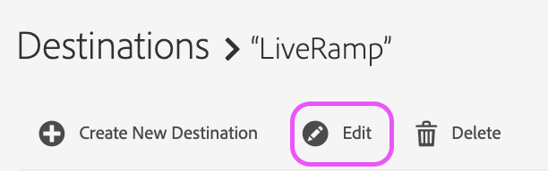

# LiveRamp伺服器對伺服器目的地

## 說明 {#description}

本文概述LiveRamp目的地在Audience Manager內。

<b>環境</b>

- Audience Manager

<b>學習目標</b>

- LiveRamp目的地設定程式
- 區段啟動程式

## 解決方法 {#resolution}

<b>LiveRamp目的地設定</b>

如果您已有現有的LiveRamp目的地，請跳至區段啟用區段。 

LiveRamp目的地是 [伺服器對伺服器整合](https://experienceleague.adobe.com/docs/audience-manager/user-guide/features/destinations/device-based/device-based-destinations-list.html?lang=en)，這表示設定會發生在後端。 第一次設定目的地時，您需要Audience Manager客戶服務團隊的協助。 請透過 [Admin Console](https://adminconsole.adobe.com/) 請求建立LiveRamp目的地。 請務必包含下列重要詳細資訊：

- 目的地名稱和說明
- LiveRamp用戶端名稱（LR代表提供的英數字元值）
- 區段對應偏好設定：手動與自動填入ID

區段對應選項會影響傳送至LiveRamp平台的方法。 請繼續閱讀區段啟用區段以取得詳細資訊。

<b>區段啟動程式</b>

客戶服務團隊建立目的地後，即可直接從UI將特定對象/區段啟動至LiveRamp目的地。 首先，您必須導覽至目的地，然後選取編輯：

您現在可以透過此畫面識別並新增您要對應的區段：

對應值會指定LiveRamp如何呈現其平台中的對象： 

如果您選擇使用自動填入來設定目的地（這是預設選項），則區段ID會自動填入對應欄位中。 這表示所有區段都會由LiveRamp平台中的ID組織。

如果您選擇手動對應區段，則可在設定對應值時，為區段選擇您自己的好記名稱或ID。 缺點是每次對應區段時都必須手動輸入這些值。 這就是為什麼預設和偏好方法涉及自動對應區段ID的原因。 如果您對此程式有任何疑問，請向Audience Manager客戶服務開啟案例，以便我們能進一步協助。
