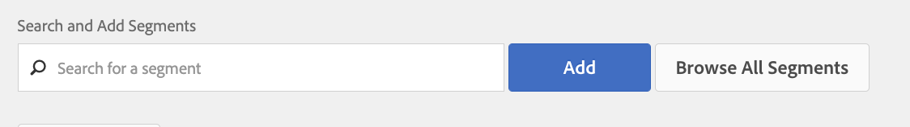

# LiveRamp伺服器對伺服器目的地

本文概述Adobe Audience Manager中的LiveRamp目的地設定。

## 說明 {#description}

<b>環境</b>

Adobe Audience Manager

<b>問題/症狀</b>

本文提供Audience Manager中LiveRamp目的地的概觀。

<b>學習目標</b>

- &#x200B;&#x200B; &#x200B;&#x200B; &#x200B; &#x200B;&#x200B;LiveRamp目的地設定程式
- 區段啟用程式

## 解決方法 {#resolution}

<b>LiveRamp目的地設定</b>

如果已有現有的LiveRamp目的地，請跳至區段啟用區段。  

LiveRamp目的地是 [伺服器對伺服器整合](https://experienceleague.adobe.com/docs/audience-manager/user-guide/features/destinations/device-based/device-based-destinations-list.html?lang=en)，這表示設定會發生在後端。 首次進行目的地設定時，您需要Audience Manager使用者服務團隊的協助。 請透過以下方式開啟案例： [Admin Console](https://adminconsole.adobe.com/) 請求建立LiveRamp目的地。 請務必包含下列重要詳細資訊：

- 目的地名稱和說明
- LiveRamp使用者名稱（LR代表提供的英數字元值）
- 區段對應偏好設定：手動與自動填色ID

區段對應選項將影響傳遞至LiveRamp平台的方法。 如需詳細資訊，請繼續閱讀區段啟用一節。

<b>區段啟用程式</b>

一旦使用者服務團隊建立目的地後，就可以直接從UI將特定對象/區段啟動到LiveRamp目的地。 首先，您必須導覽至目的地，然後選取編輯：

現在，從此畫面識別並新增您要對應的區段：

對應值會指示LiveRamp如何呈現其平台中的對象： 

如果使用者選擇以自動填入（這是預設選項）設定目的地，則區段ID會自動填入對應欄位。 這表示所有區段將會在LiveRamp平台中依ID組織。

如果使用者選擇手動對應區段，可在設定對應值時為區段選擇自己的易記名稱或ID。 其缺點是，每次對應區段時，都必須手動輸入這些值。 這就是預設和偏好方法涉及自動對應區段ID的原因。 如果您對此程式有任何疑問，請向Audience Manager使用者服務開啟案例，以便我們進一步協助。
