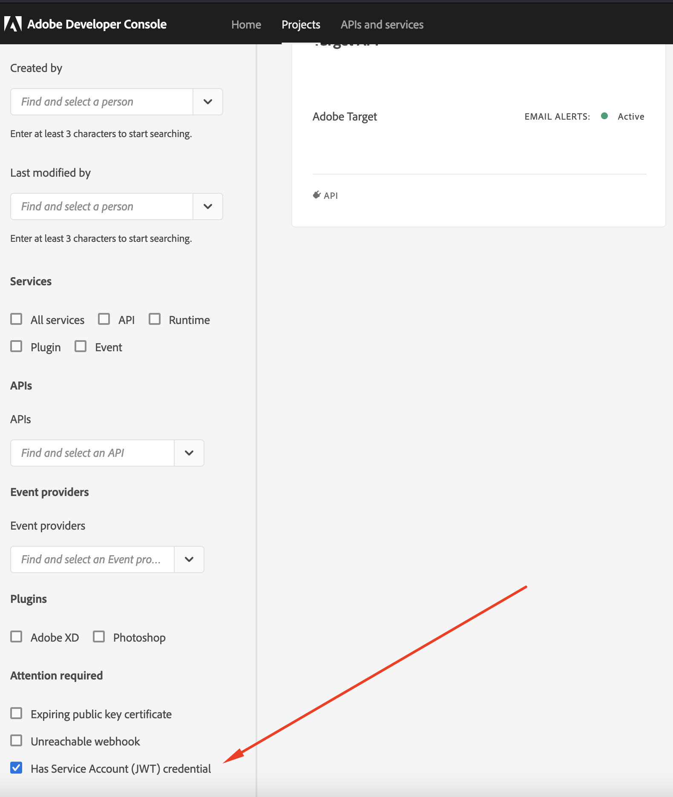
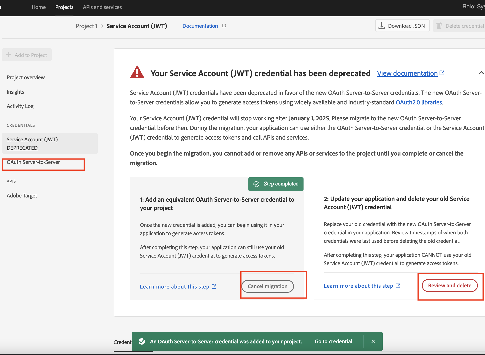
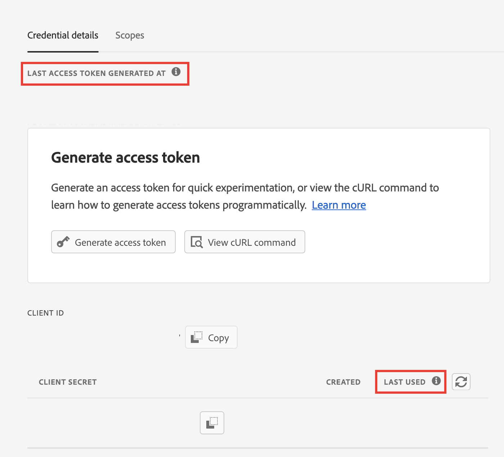
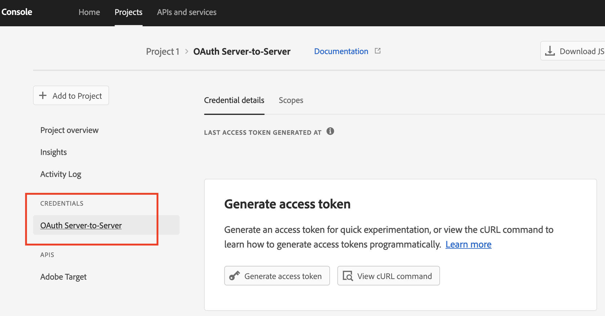

# 將認證從JWT移轉至OAuth伺服器對伺服器的步驟

瞭解如何從服務帳戶移轉至OAuth伺服器對伺服器認證，以使用新的Oauth伺服器對伺服器認證。

## 說明 {#description}

### 環境

- Analytics
- Audience Manager
- Journey Analytics

### 問題/症狀

服務帳戶(JWT)認證已遭取代，以支援新的OAuth伺服器對伺服器認證。 新的認證可讓您更輕鬆開發及維護Adobe應用程式。 它也能移除定期旋轉憑證的需求，並使用標準OAuth2程式庫立即運作。  

<b>注意：在2025年1月1日之前，您執行中的Adobe應用程式或整合都不會中斷。</b>
        <b></b>       

## 解決方法 {#resolution}

1. 登入 [Adobe Developer Console](https://developer.adobe.com/console).
2. 從左側的篩選功能表中選取選項 <b>具有服務帳戶(JWT)憑證</b>l.以這種方式顯示所有具有服務帳戶(JWT)認證的專案。

   
3. 按一下 <b>新增認證</b> 按鈕以開始移轉。

   
4. 新認證 <b>OAuth伺服器對伺服器</b> 已新增至左側。 按一下 <b>取消移轉</b> 如果您要取消移轉。 按一下 <b>檢閱並刪除 </b>驗證新認證後的按鈕 <b>OAuth伺服器對伺服器</b> 運作正常。 並刪除JWT認證以完成移轉。

   
5. 使用OAuth2.0程式庫更新使用者應用程式程式碼，以使用新認證產生存取權杖。 (請參閱下方或檢視更多程式庫，網址為 [https://oauth.net/code/](https://oauth.net/code/))。

   - [PassportJS](https://github.com/jaredhanson/passport) (Node.js)
   - [Spring Security](https://spring.io/projects/spring-security) (Java)
   - [Authlib](https://github.com/lepture/authlib) (Python)
6. 檢閱上次存取或上次使用功能表的時間戳記，以驗證使用者應用程式使用新認證產生的存取權杖。

   
7. 成功取代舊認證後，請移至刪除舊認證的最後一個步驟。

   
8. 移轉完成後，只有OAuth伺服器對伺服器的新認證會保留在左側。

<b>參考檔案</b>
為確保應用程式在2025年1月1日之後繼續運作，使用者必須將其移轉以使用新的OAuth伺服器對伺服器認證。
移轉程式相當簡單，而且可實現零停機移轉。 若要進一步瞭解，請檢視我們的檔案

1. [從服務帳戶(JWT)憑證移轉](https://nam04.safelinks.protection.outlook.com/?url=https%3A%2F%2Fpostoffice.adobe.com%2Fpo-server%2Flink%2Fredirect%3Ftarget%3DeyJhbGciOiJIUzUxMiJ9.eyJ0ZW1wbGF0ZSI6ImJsZXRoZXJfbm90aWNlX29hdXRoX3NlcnZlcl90b19zZXJ2ZXIiLCJlbWFpbEFkZHJlc3MiOiJndXd1K3NvbmVAYWRvYmV0ZXN0LmNvbSIsInJlcXVlc3RJZCI6IjM0ZjIyNTMwLThjMzEtNDlkNC1iZjEyLThlZGIyY2E0ODdhOCIsImxpbmsiOiJodHRwczovL3d3dy5hZG9iZS5jb20vZ28vZGV2c19zMnNfbWlncmF0aW9uX2d1aWRlIiwibGFiZWwiOiI5IiwibG9jYWxlIjoiZW5fVVMifQ.Pr8LjAW5wq_tEqCQLs4Y2fwJSTW_Z2FH0CIVInolEKvySfPDiF7vl8Hg4S9ne_V6a74oLfCVzc99EE9K4XUoBQ&amp;amp;data=05%7C01%7Cguwu%40adobe.com%7C3b1b2261ea264d45d9df08db4ce8a7de%7Cfa7b1b5a7b34438794aed2c178decee1%7C0%7C0%7C638188334359675040%7CUnknown%7CTWFpbGZsb3d8eyJWIjoiMC4wLjAwMDAiLCJQIjoiV2luMzIiLCJBTiI6Ik1haWwiLCJXVCI6Mn0%3D%7C3000%7C%7C%7C&amp;amp;sdata=dd8x%2FoDHh0QUi3xboxa78uA54JXEaVq5qYkP8zkvymk%3D&amp;amp;reserved=0)
2. [使用新的Oauth伺服器對伺服器認證](https://nam04.safelinks.protection.outlook.com/?url=https%3A%2F%2Fpostoffice.adobe.com%2Fpo-server%2Flink%2Fredirect%3Ftarget%3DeyJhbGciOiJIUzUxMiJ9.eyJ0ZW1wbGF0ZSI6ImJsZXRoZXJfbm90aWNlX29hdXRoX3NlcnZlcl90b19zZXJ2ZXIiLCJlbWFpbEFkZHJlc3MiOiJndXd1K3NvbmVAYWRvYmV0ZXN0LmNvbSIsInJlcXVlc3RJZCI6IjM0ZjIyNTMwLThjMzEtNDlkNC1iZjEyLThlZGIyY2E0ODdhOCIsImxpbmsiOiJodHRwczovL3d3dy5hZG9iZS5jb20vZ28vZGV2c19zMnNfY3JlZGVudGlhbF9vdmVydmlldyIsImxhYmVsIjoiMTAiLCJsb2NhbGUiOiJlbl9VUyJ9.c-c4--RAgDvS0l-WI5yIuYBIbzL7OeWXepCCfSzR1AkdVnrTZmWmm7jYmu11JqHZ_UBPANJqYEzEZrtydXY0YQ&amp;amp;data=05%7C01%7Cguwu%40adobe.com%7C3b1b2261ea264d45d9df08db4ce8a7de%7Cfa7b1b5a7b34438794aed2c178decee1%7C0%7C0%7C638188334359675040%7CUnknown%7CTWFpbGZsb3d8eyJWIjoiMC4wLjAwMDAiLCJQIjoiV2luMzIiLCJBTiI6Ik1haWwiLCJXVCI6Mn0%3D%7C3000%7C%7C%7C&amp;amp;sdata=YwiTIXMxPv9MhhEhVR3sv0g%2Bqi4NP8OERnJxE9C65I0%3D&amp;amp;reserved=0)
3. [常見問題集](https://nam04.safelinks.protection.outlook.com/?url=https%3A%2F%2Fpostoffice.adobe.com%2Fpo-server%2Flink%2Fredirect%3Ftarget%3DeyJhbGciOiJIUzUxMiJ9.eyJ0ZW1wbGF0ZSI6ImJsZXRoZXJfbm90aWNlX29hdXRoX3NlcnZlcl90b19zZXJ2ZXIiLCJlbWFpbEFkZHJlc3MiOiJndXd1K3NvbmVAYWRvYmV0ZXN0LmNvbSIsInJlcXVlc3RJZCI6IjM0ZjIyNTMwLThjMzEtNDlkNC1iZjEyLThlZGIyY2E0ODdhOCIsImxpbmsiOiJodHRwczovL3d3dy5hZG9iZS5jb20vZ28vZGV2c19zMnNfbWlncmF0aW9uX2d1aWRlX2ZhcSIsImxhYmVsIjoiMTEiLCJsb2NhbGUiOiJlbl9VUyJ9.8IlQUL_WbLKsMUDG4VHvqnwqI0l6TzEXSN0I_R_dXCswvDQpusEgm5LstaLYWzPy0crhk_ShRbmjZvMVS5t1Mg&amp;amp;data=05%7C01%7Cguwu%40adobe.com%7C3b1b2261ea264d45d9df08db4ce8a7de%7Cfa7b1b5a7b34438794aed2c178decee1%7C0%7C0%7C638188334359675040%7CUnknown%7CTWFpbGZsb3d8eyJWIjoiMC4wLjAwMDAiLCJQIjoiV2luMzIiLCJBTiI6Ik1haWwiLCJXVCI6Mn0%3D%7C3000%7C%7C%7C&amp;amp;sdata=n4WBY0gemPujdOZRaTMICsePuQJsuh9STbkgEsvyai8%3D&amp;amp;reserved=0)

如有疑問，請聯絡您的Adobe代表、支援團隊或造訪Adobe Developer Console [論壇](https://nam04.safelinks.protection.outlook.com/?url=https%3A%2F%2Fpostoffice.adobe.com%2Fpo-server%2Flink%2Fredirect%3Ftarget%3DeyJhbGciOiJIUzUxMiJ9.eyJ0ZW1wbGF0ZSI6ImJsZXRoZXJfbm90aWNlX29hdXRoX3NlcnZlcl90b19zZXJ2ZXIiLCJlbWFpbEFkZHJlc3MiOiJndXd1K3NvbmVAYWRvYmV0ZXN0LmNvbSIsInJlcXVlc3RJZCI6IjM0ZjIyNTMwLThjMzEtNDlkNC1iZjEyLThlZGIyY2E0ODdhOCIsImxpbmsiOiJodHRwczovL2V4cGVyaWVuY2VsZWFndWVjb21tdW5pdGllcy5hZG9iZS5jb20vdDUvYWRvYmUtZGV2ZWxvcGVyLWNvbnNvbGUvY3QtcC9hZG9iZS1pby1jb25zb2xlIiwibGFiZWwiOiIxMiIsImxvY2FsZSI6ImVuX1VTIn0.P8FY77-eRzVSjnf09no_Hn5owFmpREoMVLK5OSTU6WWBApUGuQH0fokMAu1R0L-uTQlCovlnIGYD7NRoqMFD8g&amp;amp;data=05%7C01%7Cguwu%40adobe.com%7C3b1b2261ea264d45d9df08db4ce8a7de%7Cfa7b1b5a7b34438794aed2c178decee1%7C0%7C0%7C638188334359675040%7CUnknown%7CTWFpbGZsb3d8eyJWIjoiMC4wLjAwMDAiLCJQIjoiV2luMzIiLCJBTiI6Ik1haWwiLCJXVCI6Mn0%3D%7C3000%7C%7C%7C&amp;amp;sdata=%2FhbICP9PCZsfsNDrBYaGlEb%2FREbBJMjNZeWPzoOPJsk%3D&amp;amp;reserved=0).
