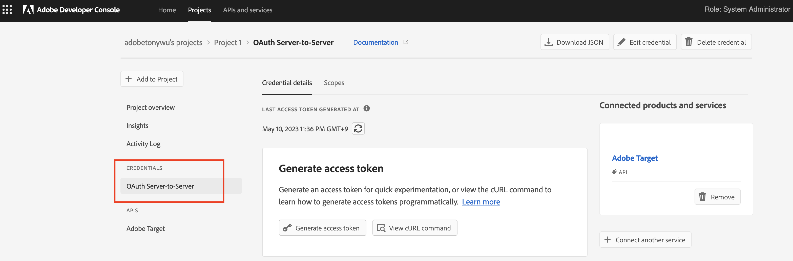

# 將認證從JWT移轉至OAuth伺服器對伺服器的逐步指南

## 說明 {#description}

將認證從JWT移轉至OAuth伺服器對伺服器的逐步指南     <b>背景：</b>
    已棄用服務帳戶(JWT)認證，改用新的OAuth伺服器對伺服器認證。  新的認證讓您更容易開發和維護Adobe應用程式。  它也會移除定期輪換憑證的需求，並可使用標準OAuth2程式庫立即運作。 

<b>注意：在2025年1月1日之前，您執行中的Adobe應用程式或整合都不會中斷。</b>        <b></b>      

## 解決方法 {#resolution}

I.登入Adobe Developer主控台([https://developer.adobe.com/console](https://developer.adobe.com/console)) 。

II. 從左側的篩選功能表中，選取「具有服務帳戶(JWT)認證」選項。
 這樣會顯示所有具有服務帳戶(JWT)認證的專案。
 

III. 按一下「新增認證」按鈕以開始移轉

四。  新的認證「OAuth伺服器對伺服器」已新增到左側。

a.如需取消移轉，請按一下[取消移轉]。
b.確認新認證「OAuth伺服器對伺服器」正常運作後，以及當您想要刪除JWT認證以完成移轉時，請按一下「檢閱並刪除」按鈕。
 

V.使用OAuth2.0程式庫更新客戶應用程式程式碼，以使用新認證產生存取權杖。

1. [PassportJS](https://github.com/jaredhanson/passport) (Node.js)
2. [Spring Security](https://spring.io/projects/spring-security) (Java)
3. [Authlib](https://github.com/lepture/authlib) (Python)
4. 檢視更多程式庫，位於  [https://oauth.net/code/](https://oauth.net/code/)

六、  檢閱「上次存取」或「上次使用」功能表的時間戳記，驗證客戶應用程式使用新憑證產生的存取Token。

七、 確定您已成功取代舊認證後，請移至刪除舊認證的最後一個步驟。

八。 現在，移轉完成時，只有新的OAuth伺服器對伺服器認證會保留在左側。

 
 
<b>參考檔案</b>
為確保您的應用程式在2025年1月1日之後繼續運作，您必須將其移轉以使用新的OAuth伺服器對伺服器認證。 移轉程式非常簡單，而且可實現零停機移轉。 若要深入瞭解，請檢視我們的檔案 
1. [從服務帳戶(JWT)憑證移轉](https://nam04.safelinks.protection.outlook.com/?url=https%3A%2F%2Fpostoffice.adobe.com%2Fpo-server%2Flink%2Fredirect%3Ftarget%3DeyJhbGciOiJIUzUxMiJ9.eyJ0ZW1wbGF0ZSI6ImJsZXRoZXJfbm90aWNlX29hdXRoX3NlcnZlcl90b19zZXJ2ZXIiLCJlbWFpbEFkZHJlc3MiOiJndXd1K3NvbmVAYWRvYmV0ZXN0LmNvbSIsInJlcXVlc3RJZCI6IjM0ZjIyNTMwLThjMzEtNDlkNC1iZjEyLThlZGIyY2E0ODdhOCIsImxpbmsiOiJodHRwczovL3d3dy5hZG9iZS5jb20vZ28vZGV2c19zMnNfbWlncmF0aW9uX2d1aWRlIiwibGFiZWwiOiI5IiwibG9jYWxlIjoiZW5fVVMifQ.Pr8LjAW5wq_tEqCQLs4Y2fwJSTW_Z2FH0CIVInolEKvySfPDiF7vl8Hg4S9ne_V6a74oLfCVzc99EE9K4XUoBQ&amp;amp;data=05%7C01%7Cguwu%40adobe.com%7C3b1b2261ea264d45d9df08db4ce8a7de%7Cfa7b1b5a7b34438794aed2c178decee1%7C0%7C0%7C638188334359675040%7CUnknown%7CTWFpbGZsb3d8eyJWIjoiMC4wLjAwMDAiLCJQIjoiV2luMzIiLCJBTiI6Ik1haWwiLCJXVCI6Mn0%3D%7C3000%7C%7C%7C&amp;amp;sdata=dd8x%2FoDHh0QUi3xboxa78uA54JXEaVq5qYkP8zkvymk%3D&amp;amp;reserved=0)
2. [使用新的Oauth伺服器對伺服器認證](https://nam04.safelinks.protection.outlook.com/?url=https%3A%2F%2Fpostoffice.adobe.com%2Fpo-server%2Flink%2Fredirect%3Ftarget%3DeyJhbGciOiJIUzUxMiJ9.eyJ0ZW1wbGF0ZSI6ImJsZXRoZXJfbm90aWNlX29hdXRoX3NlcnZlcl90b19zZXJ2ZXIiLCJlbWFpbEFkZHJlc3MiOiJndXd1K3NvbmVAYWRvYmV0ZXN0LmNvbSIsInJlcXVlc3RJZCI6IjM0ZjIyNTMwLThjMzEtNDlkNC1iZjEyLThlZGIyY2E0ODdhOCIsImxpbmsiOiJodHRwczovL3d3dy5hZG9iZS5jb20vZ28vZGV2c19zMnNfY3JlZGVudGlhbF9vdmVydmlldyIsImxhYmVsIjoiMTAiLCJsb2NhbGUiOiJlbl9VUyJ9.c-c4--RAgDvS0l-WI5yIuYBIbzL7OeWXepCCfSzR1AkdVnrTZmWmm7jYmu11JqHZ_UBPANJqYEzEZrtydXY0YQ&amp;amp;data=05%7C01%7Cguwu%40adobe.com%7C3b1b2261ea264d45d9df08db4ce8a7de%7Cfa7b1b5a7b34438794aed2c178decee1%7C0%7C0%7C638188334359675040%7CUnknown%7CTWFpbGZsb3d8eyJWIjoiMC4wLjAwMDAiLCJQIjoiV2luMzIiLCJBTiI6Ik1haWwiLCJXVCI6Mn0%3D%7C3000%7C%7C%7C&amp;amp;sdata=YwiTIXMxPv9MhhEhVR3sv0g%2Bqi4NP8OERnJxE9C65I0%3D&amp;amp;reserved=0)
3. [常見問題集](https://nam04.safelinks.protection.outlook.com/?url=https%3A%2F%2Fpostoffice.adobe.com%2Fpo-server%2Flink%2Fredirect%3Ftarget%3DeyJhbGciOiJIUzUxMiJ9.eyJ0ZW1wbGF0ZSI6ImJsZXRoZXJfbm90aWNlX29hdXRoX3NlcnZlcl90b19zZXJ2ZXIiLCJlbWFpbEFkZHJlc3MiOiJndXd1K3NvbmVAYWRvYmV0ZXN0LmNvbSIsInJlcXVlc3RJZCI6IjM0ZjIyNTMwLThjMzEtNDlkNC1iZjEyLThlZGIyY2E0ODdhOCIsImxpbmsiOiJodHRwczovL3d3dy5hZG9iZS5jb20vZ28vZGV2c19zMnNfbWlncmF0aW9uX2d1aWRlX2ZhcSIsImxhYmVsIjoiMTEiLCJsb2NhbGUiOiJlbl9VUyJ9.8IlQUL_WbLKsMUDG4VHvqnwqI0l6TzEXSN0I_R_dXCswvDQpusEgm5LstaLYWzPy0crhk_ShRbmjZvMVS5t1Mg&amp;amp;data=05%7C01%7Cguwu%40adobe.com%7C3b1b2261ea264d45d9df08db4ce8a7de%7Cfa7b1b5a7b34438794aed2c178decee1%7C0%7C0%7C638188334359675040%7CUnknown%7CTWFpbGZsb3d8eyJWIjoiMC4wLjAwMDAiLCJQIjoiV2luMzIiLCJBTiI6Ik1haWwiLCJXVCI6Mn0%3D%7C3000%7C%7C%7C&amp;amp;sdata=n4WBY0gemPujdOZRaTMICsePuQJsuh9STbkgEsvyai8%3D&amp;amp;reserved=0)

如有疑問，請聯絡您的Adobe代表、客戶支援，或造訪Adobe Developer主控台 [論壇](https://nam04.safelinks.protection.outlook.com/?url=https%3A%2F%2Fpostoffice.adobe.com%2Fpo-server%2Flink%2Fredirect%3Ftarget%3DeyJhbGciOiJIUzUxMiJ9.eyJ0ZW1wbGF0ZSI6ImJsZXRoZXJfbm90aWNlX29hdXRoX3NlcnZlcl90b19zZXJ2ZXIiLCJlbWFpbEFkZHJlc3MiOiJndXd1K3NvbmVAYWRvYmV0ZXN0LmNvbSIsInJlcXVlc3RJZCI6IjM0ZjIyNTMwLThjMzEtNDlkNC1iZjEyLThlZGIyY2E0ODdhOCIsImxpbmsiOiJodHRwczovL2V4cGVyaWVuY2VsZWFndWVjb21tdW5pdGllcy5hZG9iZS5jb20vdDUvYWRvYmUtZGV2ZWxvcGVyLWNvbnNvbGUvY3QtcC9hZG9iZS1pby1jb25zb2xlIiwibGFiZWwiOiIxMiIsImxvY2FsZSI6ImVuX1VTIn0.P8FY77-eRzVSjnf09no_Hn5owFmpREoMVLK5OSTU6WWBApUGuQH0fokMAu1R0L-uTQlCovlnIGYD7NRoqMFD8g&amp;amp;data=05%7C01%7Cguwu%40adobe.com%7C3b1b2261ea264d45d9df08db4ce8a7de%7Cfa7b1b5a7b34438794aed2c178decee1%7C0%7C0%7C638188334359675040%7CUnknown%7CTWFpbGZsb3d8eyJWIjoiMC4wLjAwMDAiLCJQIjoiV2luMzIiLCJBTiI6Ik1haWwiLCJXVCI6Mn0%3D%7C3000%7C%7C%7C&amp;amp;sdata=%2FhbICP9PCZsfsNDrBYaGlEb%2FREbBJMjNZeWPzoOPJsk%3D&amp;amp;reserved=0).
