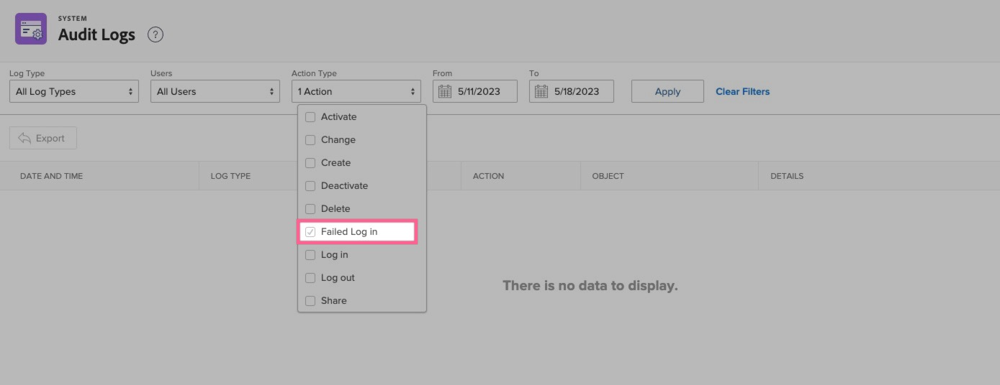

# 登入錯誤，因為使用者未對應SSO （單一登入）

若要解決登入錯誤，請檢查Workfront帳戶中列出的同盟ID ，並使用稽核記錄作為疑難排解工具。

## 說明 {#description}

### 環境

Workfront

### 問題/症狀

嘗試使用單一登入(SSO)透過Workfront登入時，頁面會重新導向至Workfront登入頁面。 在登入頁面的網址列上，出現錯誤訊息，指出「使用者未對應」。

## 解決方法 {#resolution}

1. 導覽至Workfront中收到此錯誤的特定使用者：
   - [編輯使用者](https://experienceleague.adobe.com/docs/workfront/using/administration-and-setup/add-users/create-manage-users/edit-a-users-profile.html?lang=en).
   - 如果沒有使用者帳戶存在， [建立新使用者](https://experienceleague.adobe.com/docs/workfront/using/administration-and-setup/add-users/create-manage-users/add-users.html?lang=en) 帳戶。
2. 確認使用者已列出同盟ID：
   - 檢查同盟識別碼。
3. 如果Federation ID為空白，請遵循下列步驟：
   - 輸入您的身分提供者所提供的使用者同盟ID （區分大小寫）。
   - 按一下<b>「儲存」</b>。
   - 注意：同盟ID區分大小寫，且必須與從身分提供者傳送至Workfront的方式完全相符。 如果您不確定Federation ID或其區分大小寫，請洽詢您的網路或IT管理員。
   - 此外，請檢查同盟ID之前或之後的任何額外空格，因為這些空格可能是此錯誤的原因。

選用步驟：稽核記錄

使用Workfront中的稽核記錄作為疑難排解工具，可檢查您的身分提供者在登入嘗試失敗期間傳遞為同盟ID （名稱ID）的內容。

1. 按一下 <b>設定</b>
2. 移至系統 `>`  [稽核記錄](https://experienceleague.adobe.com/docs/workfront/using/administration-and-setup/add-users/create-manage-users/audit-logs.html?lang=en)
3. 套用篩選器以顯示失敗的登入嘗試
   - 向下篩選至失敗的登入嘗試 
   - 按一下<b>套用</b>。
4. 從身分提供者傳遞至Workfront的同盟ID （名稱ID）會顯示在最近失敗的登入嘗試之詳細資訊欄中。
   - 確保詳細資料欄中顯示的此Federation ID與Workfront中作為Federation ID輸入的完全相符（區分大小寫）。
